# Kondo Codebase Audit

Prepared as a fact-finding pass, not a design review. Every claim below cites a file (and
usually a line/function). Where something depends on runtime/production state rather than
static code, it's marked `UNVERIFIED — needs a run` with the exact check that would settle
it. Nothing was refactored, renamed, or fixed as part of this pass.

**Correcting the working description going in:** the pipeline described as "brief + reference
sites + design spec + generated redesigned site" is **not what the code does today**. It was
the *previous* architecture and was completely, deliberately torn out in one migration
(`prisma/migrations/20260731120000_rebuild_content_pipeline/migration.sql`) on 2026-07-31 —
tables dropped (`AuditReport`, `Generation`, `GenerationMessage`, `GenerationRun`, `JobOutcome`,
`Reference`), columns dropped (`Client.briefText/businessType/designSpec/designSpecApprovedAt/
intent/interpretedBrief/interpretedBriefApprovedAt`, `CrawledPage.htmlPath/screenshotPath`), and
dev data truncated outright. **The code has moved on — the code wins**, per the audit's own
ground rules. What exists now: crawl a site → deterministic image/text processing → **one**
Claude call that extracts and rewrites content into a fixed JSON shape → human review/approval →
deterministic (non-AI) template render → publish. No screenshots, no reference-site comparison,
no multi-call "design generation" sequence exists anywhere in the live code. A few source
comments (noted throughout) still describe the old architecture and were never updated after
the rebuild — those are flagged individually below, not treated as current behaviour.

---

## Executive summary

1. **The architecture you described is gone.** It was replaced wholesale by the current
   crawl→extract→template pipeline in a single migration on 2026-07-31. Nothing of the old
   "brief / design spec / generation run" model survives in the schema or code — verified by
   grepping for every dropped table/column/enum name across the whole repo (zero hits outside
   `prisma/migrations/`).
2. **The team's own `SECURITY-CHECKLIST.md` is stale** — it describes the old architecture
   (design-spec approval, a "Call 0/1/2" AI sequence, a `Generation` table, different audit
   event names) in several places, and its claim about a debug-gated log line doesn't match
   what's actually in code. Don't treat it as an accurate current-state document without a
   pass to update it.
3. **Code quality mechanics are genuinely solid, not aspirational.** All 55 tests pass, `tsc
   --noEmit` is clean, lint is clean (0 warnings/errors), the build succeeds, there are zero
   `any`/`@ts-ignore` escape hatches anywhere, and zero TODO/FIXME/HACK comments in the
   codebase. This is a young (24 days, 45 commits, single author), disciplined codebase.
4. **There is no per-client access control.** Any authenticated `@jrnydigital.com.au` user
   with MFA enrolled can read, edit, publish, or permanently delete *any* client's data — a
   flat trust model across all staff, not a bug exactly, but worth knowing before you scale
   the team using this tool.
5. **One real, if narrow, security gap:** the experimental per-section AI editor inserts
   Claude-generated HTML directly into publicly served pages, guarded only by a two-pattern
   regex (blocks `<script>` tags and inline event handlers — nothing else). Production CSP
   still allows `'unsafe-inline'` scripts, which removes the backstop that would otherwise
   contain a slip-through. This feature also has zero rate limiting wired to it (the rate
   limiter function exists; nothing calls it for this path).
6. **Rate limiting and the daily spend ceiling fail open (silently disabled)** if
   `UPSTASH_REDIS_REST_URL`/`TOKEN` aren't set — this is honestly self-documented in code, but
   whether those env vars are actually set in production is `UNVERIFIED — needs a run`.
7. **Storage is clean — nothing depends on ephemeral disk.** Structured content and generated
   concept HTML live in Postgres; images live in Supabase Storage. This was a deliberate fix
   made during the July 31 rebuild (the old architecture stored HTML/screenshots by local
   file path, which is exactly the kind of thing that silently breaks on redeploy).
8. **The single most expensive and most fragile call is `structureAndRewriteContent`**
   (`lib/content/structure-and-rewrite.ts`) — one large Claude call with a hardcoded model
   string (`"claude-sonnet-5"`, duplicated in two files, no shared constant), no raw-response
   persistence (a parsing failure loses the actual model output — only a short reason string
   survives), and a full-repayload retry that can 3x the call's cost on a shape-validation
   failure.
9. **`ContentRecord`'s JSON field shape is the most load-bearing concept in the app.** It's
   threaded through the AI tool schema, the review UI, `to-template-content.ts`, and all
   three templates. Changing *what gets extracted* touches all of those. Changing *what it
   becomes* (swapping/adding a template) touches none of the AI layer — that boundary is the
   real seam if you're planning a redirect.
10. **No admin/ops visibility exists.** There's no job-history view, no queue-depth dashboard,
    no "what happened on this run" beyond the last failure message on a client's own page.
    Inspecting pipeline history today means querying Postgres directly.

---

## 1. Shape of the repo

### Directory tree (depth-limited, excluding node_modules/.next/.git/build output)

```
kondo/
├── .github/workflows/ci.yml
├── .nvmrc, .env.example, .env (untracked, local only)
├── AGENTS.md, CLAUDE.md, README.md, SECURITY-CHECKLIST.md
├── app/
│   ├── (app)/                      # authenticated UI: clients list/detail, concepts, templates, trash
│   ├── api/clients/[id]/{status,concepts/[conceptId]/download}/route.ts
│   ├── generated/prisma/           # generated Prisma client — gitignored
│   ├── login/, mfa/                # auth pages
│   ├── p/[slug]/route.ts           # public published-concept route
│   └── layout.tsx, error.tsx, global-error.tsx, globals.css
├── components/                     # 15 shared React components
├── lib/
│   ├── actions/                    # server actions (analysis, auth, clients, concepts, content, mfa, publish, trash)
│   ├── ai/                         # Anthropic retry + JSON tool-call utilities
│   ├── auth/, security/            # domain allowlist, rate-limit, SSRF guard
│   ├── content/                    # crawl→extract→structure pipeline (24 files)
│   ├── crawl/                      # Playwright crawler, robots, URL utils
│   ├── jobs/queue.ts               # Job table queue (poll-based)
│   ├── media/, storage/, supabase/, templates/ (atlas, ledger, showcase), validation/
│   └── prisma.ts
├── prisma/
│   ├── schema.prisma (282 lines)
│   └── migrations/ (24 migrations, 2026-07-22 → 2026-08-13)
├── proxy.ts, instrumentation.ts, instrumentation-client.ts
├── sentry.{server,edge}.config.ts
├── scripts/{worker.ts, check-audit.mjs, check-extraction.ts}
├── storage/                        # gitignored local dev artifact
├── public/, railway.toml, next.config.ts, package.json, tsconfig.json, vitest.config.mts
```
`.claude/`, `.agents/`, `.windsurf/` each hold identical Prisma reference-doc skill bundles —
agent tooling scaffolding, not app code.

### Runtime versions / package manager

- `.nvmrc` pins Node `22`; `package.json` `engines.node` requires `>=22.12.0` — a floor, not
  an exact pin.
- Only `package-lock.json` exists (no yarn/pnpm lockfile) → npm.
- `package.json:14` pins `next` to exact `16.2.12` (no `^`) and `react`/`react-dom` to exact
  `19.2.4` — everything else uses `^`. `eslint-config-next` is deliberately kept in lockstep
  at the same exact `16.2.12`. `scripts/check-audit.mjs` explains why: `next` is pinned to
  hold a specific patch-level security fix, and upgrading needs the audit-exception file
  revisited.
- `prisma`/`@prisma/client`/`@prisma/adapter-pg` are all `^7.9.0` (Prisma 7). `prisma` (the
  CLI) is listed under `dependencies`, not `devDependencies` — atypical but deliberate: the
  build script (`prisma generate && next build`) needs the CLI at build time in an
  environment that may not install devDependencies.

### Dependencies

**dependencies** — purpose and usage:

| Package | Purpose | Usage found |
|---|---|---|
| `@anthropic-ai/sdk` | Claude API client | 3 files (content pipeline) |
| `@prisma/adapter-pg` | Prisma's Postgres driver adapter | 2 files |
| `@prisma/client` | ORM client | 13 files |
| `@sentry/nextjs` | Error tracking, Next app | 3 files |
| `@sentry/node` | Error tracking, worker process | 1 file (`scripts/worker.ts`) |
| `@supabase/ssr` | Cookie-based Supabase auth client | 3 files |
| `@supabase/supabase-js` | Supabase client (storage, auth) | 3 files |
| `@upstash/ratelimit` | Sliding-window rate limiting | 1 file |
| `@upstash/redis` | Redis client for rate limiting | 1 file |
| `adm-zip` | ZIP file creation | **0 files — unused, dead dependency** |
| `next` | Framework | 27 files |
| `pg` | Postgres driver (peer of the adapter) | 0 direct imports — transitive |
| `playwright` | Headless browser crawling | 3 files, all worker-only |
| `prisma` | ORM CLI | 0 direct TS imports (used via npm scripts) |
| `react` / `react-dom` | UI | 17 / 2 files |
| `sharp` | Image processing | 4 files, all worker-only |
| `tsx` | TS execution for scripts | 0 direct imports (used via npm scripts) |
| `zod` | Schema validation | 1 file — light usage for a core listed dependency |

**devDependencies:** `@tailwindcss/postcss`, `tailwindcss`, `@types/*`, `dotenv` (used only by
`prisma.config.ts:3`), `eslint` + `eslint-config-next` + `eslint-plugin-jsx-a11y` (all wired
in `eslint.config.mjs`), `typescript`, `vitest`. All in active use.

**Confirmed dead:** `adm-zip` has zero references anywhere in the codebase. The one plausible
call site — the concept download route
(`app/api/clients/[id]/concepts/[conceptId]/download/route.ts:42-47`) — streams raw HTML
directly, no zipping.

**Confirmed dead code (not a dependency, a file):** `lib/media/prepare-image.ts` exports
`prepareImageBufferForApi`/`prepareImageFileForApi` (uses `sharp`) but is imported nowhere —
confirmed via repo-wide grep for the file path and both function names. Looks like a helper
superseded by `resize-for-vision.ts`/`assess-image-quality.ts`.

**Heavy dependencies — confirmed worker-only, never touch the Vercel bundle:**
- `playwright` (bundles Chromium): imported only by `lib/crawl/crawler.ts`,
  `lib/crawl/extract.ts`, `lib/crawl/goto-and-settle.ts`. Only reachable via
  `lib/content/run-analysis.ts` → `scripts/worker.ts`. `railway.toml` installs Chromium only
  for the worker build.
- `sharp`: imported in `assess-image-quality.ts`, `extract-colors.ts`, `resize-for-vision.ts`
  (all called from `run-analysis.ts`, worker-only) and the dead `prepare-image.ts`. No `app/`
  file imports it directly. Note: Next's own bundled `sharp` (used by `next/image`) is a
  *separate* copy from the app's direct dependency.

### Line-of-code counts by top-level directory
(excludes `app/generated/prisma`; `.ts`/`.tsx`/`.mjs`/`.js` only)

| Directory | Lines | Files |
|---|---|---|
| `app/` | 1,337 | 21 |
| `lib/` | 8,665 | 70 |
| `components/` | 1,601 | 15 |
| `scripts/` | 255 | 3 |
| `prisma/` | schema.prisma 282 lines + migrations SQL 589 lines | — |

`app/generated/prisma` (gitignored, generated): 16 files, ~17,000 lines, 742KB on disk —
excluded from "real code" counts, but the single largest artifact by line count if anyone
runs a naive `find . -name '*.ts' | xargs wc -l`.

`lib/` is the bulk of hand-written logic (70 files, ~8.7k lines) vs. `app/`+`components/`
(~2.9k lines) — this is a backend/pipeline-heavy tool, not a UI-heavy one.

### Git

- Branch `main`, tracking `origin/main`, up to date, clean working tree, no stashes.
- Only one remote branch — no long-lived feature branches.
- 45 total commits, **single author** for 100% of history (`git shortlog -sn --all`).
- History spans 2026-07-22 → 2026-08-14 (~3.5 weeks), matching the migration timestamps.
- Recent commits show a shift from feature-building toward hardening: `ecbe824` "Close out
  production readiness: reliability, gating, tests, a11y, observability", `a9134fb` "Fix
  DIRECT_URL guidance to the session pooler, and track .env.example at all", `3cbfa6b` (HEAD)
  "Add per-section AI concept editing; fix an image-dedup key collision and a bot-challenge
  crawl gap".
- **Historical doc/repo gap, now fixed:** commit `a9134fb`'s message ("...track .env.example
  at all") corroborates a `.gitignore` comment stating `.env.example` was previously caught
  by the blanket `.env*` ignore rule and was never actually committed — i.e., for part of
  this project's history, following the README's own setup instructions ("copy `.env.example`
  to `.env`") would have found no file to copy. Fixed now (`!.env.example` added).

---

## 2. The pipeline, end to end

This is the single most important section for a redirect decision, so it's traced in full
below — file and function for every stage, verified live vs. dead, ending in a Mermaid diagram
reflecting only what's confirmed wired.

### Stage 0 — Add client

- UI: `app/(app)/clients/new/page.tsx` → server action `createClient`
  (`lib/actions/clients.ts:22-57`).
- Input: `name`, `siteUrl` (Zod-validated). Synchronous, in-request. Validates the URL is
  safe (`checkUrlIsSafe`, SSRF guard) **before** any DB write.
- Output: one `Client` row, `status: NEW`. Plain `prisma.client.create` — no queueing yet.
- Failure handling: validation/SSRF failures return a typed `{error}` state (no throw); an
  unexpected DB failure throws to `app/(app)/error.tsx`.
- Audit: `CLIENT_CREATED` logged.

### Stage 1 — "Analyse Site" click → job enqueued (synchronous, in the server action)

- `startAnalysis(clientId)`, `lib/actions/analysis.ts:17-72`.
- Guards run in order, all in-request: fast no-op if already `ANALYZING` →
  `checkCrawlRateLimit` (per-user) → `countActiveJobsForUser` vs. `MAX_CONCURRENT_JOBS_PER_USER`
  (comment at `analysis.ts:33-36` flags this cap as previously *dead* — defined but never
  invoked until this call was added) → `checkGlobalDailySpendCeiling` (checked last because
  it has a side effect) → an atomic `updateMany` claim
  (`status: {not: "ANALYZING"} → "ANALYZING"`) — the real race guard, not the earlier read.
- Output on success: `Client.status = ANALYZING`, `crawlPagesDone = 0`,
  `crawlPagesTotal = null`; one `Job` row inserted via `enqueueJob("ANALYZE_SITE", {...})`
  (`lib/jobs/queue.ts:16-25`), `status: "PENDING"`. Audit: `ANALYSIS_STARTED`.
- **This is the queue boundary** — nothing about the crawl or AI call runs here. The request
  returns as soon as the `Job` row commits.

### The queue mechanism — verified, not aspirational

`lib/jobs/queue.ts` is a **plain Postgres-polled queue, not a real message broker** (no
BullMQ/Redis/SQS):
- `claimNextJob()` (`queue.ts:41-50`) is a raw SQL
  `UPDATE ... WHERE id = (SELECT ... FOR UPDATE SKIP LOCKED) RETURNING ...` — that's the
  entire "queue" implementation. Safe for multiple worker processes, but there's exactly one
  job type (`"ANALYZE_SITE"`) and effectively one active worker loop.
- `scripts/worker.ts:57-75` (`main()`) is a bare `for (;;)` loop: `claimNextJob()`, and if
  nothing found, `setTimeout` 3000ms and loop again. No listen/notify, no external broker.
- Orphan recovery: `reclaimOrphanedJobs()` (`queue.ts:107-129`) runs **once, at worker
  startup only** — reclaiming any `Job` stuck `RUNNING` for >90 minutes
  (`STALE_JOB_TIMEOUT_MS`), sized against the pipeline's own worst-case timing (crawl ~51min
  + image downloads ~9min + structuring retries ~16min ≈ 76min, per the comment). Flips the
  client back to `ANALYSIS_FAILED` with a `"Orphaned: ..."` message. **Because this only runs
  at startup, a job that hangs while the worker process itself stays alive is never
  reclaimed until the next restart.**
- The worker is a separate deployment (Railway), not a Vercel function — confirmed real:
  `scripts/worker.ts` imports `@sentry/node` directly (not `@sentry/nextjs`) and runs as a
  standalone `tsx` process via `npm run worker`/`worker:prod`.

`UNVERIFIED — needs a run`: whether the Railway worker is actually deployed and running
continuously in production. Check Railway logs for `[worker] started, polling for jobs...`,
or `SELECT status, count(*) FROM "Job" GROUP BY status` for stuck `PENDING` rows.

### Stage 2 — Worker picks up the job (background, `scripts/worker.ts`)

- `dispatch()` (`worker.ts:29-38`) switches on `job.type`; only `"ANALYZE_SITE"` exists,
  calling `runAnalysisInBackground(clientId, siteUrl)`.
- `processJob()` (`worker.ts:40-55`): success → `completeJob(id)` (`Job.status = "COMPLETE"`).
  Any throw → `failJob(id, message)` (`Job.status = "FAILED"`, `lastError` truncated to 4000
  chars). Explicit contract in the comment: `runAnalysisInBackground` must revert
  `Client.status` itself and rethrow — the worker's catch is Job-row bookkeeping only.
- Every exception also goes to Sentry (`captureException`, with `jobId`/`jobType` context).

### Stage 3 — `runAnalysisInBackground` (the actual pipeline; `lib/content/run-analysis.ts:34-304`)

One function owns the entire crawl→extract→structure→persist sequence, inside one
`try {...} catch { revert to ANALYSIS_FAILED; rethrow }`. Sub-steps, in order:

1. **Clear stale data**: `prisma.crawledPage.deleteMany({clientId})` — `CrawledPage` is
   explicitly not append-only.
2. **Crawl** — `crawlClientSite` (`lib/crawl/crawler.ts:15-161`). Playwright/Chromium, BFS
   from the start URL, `MAX_PAGES=150`, `PAGE_TIMEOUT_MS=20s`, `REQUEST_DELAY_MS=400ms`
   between pages. Per page: SSRF-checked navigation, bounded "load" wait (not
   `networkidle`), then a bot/challenge-page detector and non-2xx check — both skip-but-
   continue, not a crawl failure. Each successfully extracted page writes immediately to
   `CrawledPage` (title, `textContent` truncated to 20k chars) and updates
   `Client.crawlPagesDone/crawlPagesTotal` (what the UI polls). **No retry** at this layer —
   a single crawl attempt; retries only exist at the AI-call layer.
3. **Select relevant pages** — `selectRelevantPages` (`lib/content/select-relevant-pages.ts:152-206`).
   Pure in-memory scoring/dedup, 40k-char budget. This is what makes `pagesAnalyzed <
   crawlPagesCount` on any real site.
4. **Download images** — `downloadCrawlImages` (`lib/crawl/download-images.ts:168-232`).
   Deterministic logo pick (frequency across all pages), up to `MAX_CANDIDATE_IMAGES=10`
   gallery candidates, junk-filtered before download, uploaded to Supabase Storage, one
   `Asset` row per new image (content-hash deduped).
5. **Image quality/geometry pass** — quality flag, size-based junk filter, deterministic
   hero selection, partner-logo classification, and a deterministic geometry pre-pass that
   force-sets `subject: "abstract"` on implausible-as-photo images **before** anything is
   sent to the vision model. All confirmed wired in, none dead (see below).
6. **Brand colors** — dominant-color extraction with a neutral-palette fallback.
7. **Contact extraction** — deterministic regex/link scan over *all* crawled pages (not just
   selected ones — cheap, not AI-token-bound).
8. **Vision resize** — `resizeForVisionClassification`, run only on the images that survived
   the geometry pre-pass — produces the base64 JPEG blocks sent to Claude.
9. **The one AI call** — `structureAndRewriteContent` (`lib/content/structure-and-rewrite.ts:569-674`).
   See Section 3 for full detail. Single Claude call, forced tool use, retried on shape
   failure (3 outer attempts) and independently on transient infra errors (5 inner attempts).
10. **Post-hoc anomaly flags** — `possibleExtractionCollapse` and
    `possibleImageMisclassification`, both calibrated against real client runs per inline
    comments, surfaced as warning banners in the review UI.
11. **Persist** — one `prisma.contentRecord.upsert({where:{clientId}})`, explicitly resetting
    `reviewedAt`/`reviewedByUserId` to `null` on every write (first run and every re-analysis).
12. **Status flip** — `Client.status = "READY_FOR_REVIEW"`. Any exception anywhere in 1–11 →
    `Client.status = "ANALYSIS_FAILED"`, `ANALYSIS_FAILED` audit event logged (the comment
    notes this event existed in the enum but was never actually called before this change —
    previously a dead audit path), rethrow to the worker.

Everything in Stage 3 runs in the background worker process, synchronously within one
function call — not further sub-queued.

### Stage 4 — Progress polling (client-side, separate from the pipeline)

`components/AnalysisProgress.tsx:20-33` polls `GET /api/clients/[id]/status` every **2
seconds** while `status === "ANALYZING"`, reading `{status, crawlPagesDone,
crawlPagesTotal}`. Since only the crawl loop (step 2) updates those counters, the progress
bar is accurate only during crawling — steps 3–11 show a generic indeterminate pulse with no
further granularity (acknowledged directly in the component's own comment).

### Stage 5 — Review Extraction (synchronous, human-gated)

- `ContentReviewForm` on the client page, backed by `updateContentRecord`/
  `approveContentRecord` (`lib/actions/content.ts:273-292`).
- **The real gate is `contentRecord.reviewedAt != null` — not `Client.status`.** Confirmed by
  every downstream check: `createConcept` throws if `!reviewedAt`; the template/preview pages
  both redirect if `!reviewedAt`. `Client.status`, per its own schema comment, is "purely a
  progress indicator... never a gate." This matches the README's "nothing downstream runs
  without approval" claim — verified true, but the *mechanism* is a nullable timestamp on
  `ContentRecord`, not the enum a reader might assume gates things.
- `updateContentRecord` saves without touching `reviewedAt`; `approveContentRecord` saves +
  sets it. Optimistic-concurrency guard on a hidden `recordUpdatedAt` field — a stale submit
  throws rather than silently clobbering fresher data.

### Stage 6 — Choose Template (synchronous, deterministic, no AI/Playwright)

- `toTemplateContent(contentRecord, assets)` (`lib/content/to-template-content.ts:24-179`)
  flattens the DB record into template-facing shape, resolves logo/hero/gallery URLs
  (multi-tier hero fallback), strips confidence/flag metadata.
- `scoreAllTemplates`/`pickDefaultTemplate` (`lib/templates/registry.ts:127-155`) score the 3
  registered templates against this client's actual content coverage.
- Every template-gallery card is rendered via the identical `renderTemplateToHtml()` used
  later for publish — no separate thumbnail/screenshot pipeline. **Nothing persisted** at this
  stage — pure ephemeral render (confirmed by the `Concept` model's own schema comment).

### Stage 7 — Generate & Preview → Generate Concept (first persistence of output)

- "Generate Concept" submits to `createConcept(clientId, templateKey)`
  (`lib/actions/concepts.ts:19-54`). Re-checks `reviewedAt`, re-fetches content/assets
  server-side (never trusts client-supplied HTML), renders again — **this is the one and
  only point a `Concept` row is created**, `html` (fully inlined, absolute Storage URLs)
  stored directly in Postgres (chosen specifically because Vercel's filesystem is
  ephemeral, per the model's own comment). Audit: `CONCEPT_GENERATED`.

### Stage 8 — Concept page: section edit (optional, a second, narrow AI call)

- `editConceptSection` (`lib/actions/concepts.ts:66-115`) →
  `editConceptSectionHtml` (`lib/content/edit-concept-section.ts`). Scoped to one section via
  `extractConceptSection`/`replaceConceptSection` (`lib/templates/section-editor.ts`) with a
  per-concept-per-section CSS scope prefix. Updates `Concept.html` in place. Failure returns
  a typed error to the form, not a throw — this failure path does **not** kill a job/client
  status.

### Stage 9 — Publish

- `publishConcept` (`lib/actions/publish.ts:30-67`): generates a `publishSlug` if none yet
  (retried up to 5x on collision), sets `publishStatus: "PUBLISHED"`. Re-publish reuses the
  slug. `unpublishConcept` sets `"UNPUBLISHED"` (slug retained). Both check `client.deletedAt`.
- **Public serving**: `app/p/[slug]/route.ts:12-28` — deliberately unauthenticated `GET`,
  looks up by slug, 404s unless `publishStatus === "PUBLISHED"`, serves the frozen
  `Concept.html` directly with `X-Robots-Tag: noindex, nofollow`. Comment notes this route
  serves "hand-authored trusted templates" — see Section 5.7 for why that framing is no
  longer fully accurate once a section edit has touched the HTML.

### State machine — every status/enum value found

- **`ClientStatus`**: `NEW → ANALYZING → (READY_FOR_REVIEW | ANALYSIS_FAILED)`. Explicitly
  documented as a progress indicator only — never a gate.
- **`Job.status`** (plain string, not a Prisma enum; comment values
  `PENDING | RUNNING | COMPLETE | FAILED`): `PENDING → RUNNING → COMPLETE | FAILED`, plus an
  orphan path `RUNNING → FAILED` after 90 minutes (worker-startup only, see above).
- **`ContentRecord.reviewedAt`**: `null ⇄ timestamp`. The actual approval gate for the rest
  of the flow. Reset to `null` on every fresh analysis (first run or re-analysis).
- **`Concept.publishStatus`** (plain string; comment values `DRAFT | PUBLISHED | UNPUBLISHED`):
  `DRAFT → PUBLISHED → UNPUBLISHED → PUBLISHED...`. No path returns a `Concept` to `DRAFT`
  once published.

There is **no separate "run"/"generation" state machine** in the live schema — that
architecture was removed in the rebuild.

### Screenshots — confirmed vestigial, not part of the live pipeline at all

Direct answer to the audit's specific question: **screenshot capture is not part of the
current pipeline anywhere.** `CrawledPage.screenshotPath` was dropped in the rebuild
migration and doesn't exist in the current model. The only remaining hits for "screenshot"
are a stale comment in `lib/crawl/goto-and-settle.ts:10-14` referencing two files —
`lib/crawl/visual-shots.ts` and `lib/crawl/reference-screenshot.ts` — that **no longer
exist** (confirmed by listing `lib/crawl/*.ts` in full), and an unrelated line in
`TemplateGallery.tsx` explicitly noting templates use "no separate thumbnail/screenshot
pipeline." The `goto-and-settle.ts` comment is stale documentation of the pre-rebuild
architecture — harmless (doesn't affect behavior) but factually wrong about what currently
exists.

Similarly, `lib/ai/anthropic-retry.ts:3` claims "every Anthropic call site in the generation
pipeline (`design-direction.ts`, `visual-read.ts`, `brief-synthesis.ts`, `build-page.ts`,
`generate.ts`)" — **none of these five files exist**. Only `structure-and-rewrite.ts` and
`edit-concept-section.ts` actually call `withTransientRetry` today. Textbook stale comment
from before the rebuild.

### Image-processing files — checked individually, all wired into the live path

Contrary to the hypothesis that these might be pre-rebuild leftovers, all five are actively
called from `run-analysis.ts`: `resize-for-vision.ts`, `assess-image-quality.ts`,
`classify-partner-logos.ts`, `select-hero-image.ts`, `filter-junk-images.ts`. None of this is
dead code — it's the deterministic pre/post-processing layer around the one vision-enabled
Claude call.

### Mermaid diagram — verified live path only

```mermaid
flowchart TD
    A["Add Client form\nlib/actions/clients.ts: createClient"] -->|"Client row, status=NEW"| B["Client Workspace page"]
    B -->|"click Analyse/Re-analyse Site"| C["lib/actions/analysis.ts: startAnalysis\n(sync, in server action)"]
    C -->|"rate limit + concurrency + spend checks,\natomic status claim"| D["Client.status=ANALYZING\nJob row created (PENDING)\nlib/jobs/queue.ts: enqueueJob"]
    D -.->|"client polls every 2s"| P["/api/clients/[id]/status\ncomponents/AnalysisProgress.tsx"]

    D --> E["scripts/worker.ts main loop\npolls Postgres every 3s\nclaimNextJob() FOR UPDATE SKIP LOCKED"]
    E -->|"job claimed, status=RUNNING"| F["runAnalysisInBackground\nlib/content/run-analysis.ts"]

    F --> F1["crawlClientSite\nlib/crawl/crawler.ts\nPlaywright BFS, max 150 pages\nwrites CrawledPage rows,\nupdates crawlPagesDone/Total"]
    F1 --> F2["selectRelevantPages\nlib/content/select-relevant-pages.ts\n(40k char budget, in-memory)"]
    F2 --> F3["downloadCrawlImages\nlib/crawl/download-images.ts\n-> Supabase Storage, Asset rows"]
    F3 --> F4["deterministic image passes:\nassess-image-quality, filter-junk-images,\nselect-hero-image, classify-partner-logos\n(all in-memory)"]
    F4 --> F5["resizeForVisionClassification\nlib/content/resize-for-vision.ts"]
    F5 --> F6["structureAndRewriteContent\nlib/content/structure-and-rewrite.ts\nONE Claude call, tool-forced\nretries: 3x shape-validation\n+ 5x transient (anthropic-retry.ts)"]
    F6 --> F7["contentRecord.upsert\nreviewedAt reset to null\nClient.status = READY_FOR_REVIEW"]
    F7 -->|"on any error anywhere above"| FE["catch: Client.status = ANALYSIS_FAILED\nlogAuditEvent ANALYSIS_FAILED\nrethrow"]
    FE --> E2["worker: failJob(Job.status=FAILED)"]
    F7 --> E1["worker: completeJob(Job.status=COMPLETE)"]

    E1 --> G["Review Extraction\nContentReviewForm\nlib/actions/content.ts:\nupdateContentRecord / approveContentRecord"]
    G -->|"approveContentRecord sets reviewedAt"| H{"reviewedAt != null?\n(THE real gate, not Client.status)"}
    H -->|"no"| G
    H -->|"yes"| I["Choose Template\nlib/templates/registry.ts render\n(sync, deterministic, no AI)\nephemeral only, nothing persisted"]
    I --> J["Generate & Preview\n(same deterministic render)"]
    J -->|"Generate Concept"| K["lib/actions/concepts.ts: createConcept\nFIRST persistence: Concept row\n(html frozen in Postgres)"]
    K --> L["Concept page:\noptional editConceptSection\n(small scoped AI call + retry)"]
    L --> M["lib/actions/publish.ts: publishConcept\nsets publishSlug, publishStatus=PUBLISHED"]
    M --> N["app/p/[slug]/route.ts\npublic, unauthenticated GET\nserves frozen Concept.html"]

    style FE fill:#5a1d1d,color:#fff
    style E fill:#1d3a5a,color:#fff
    style F fill:#1d3a5a,color:#fff
```



### Cannot verify from code alone

1. Whether the Railway worker is actually running in production right now.
2. Actual end-to-end latency for a real site (the ~76-minute worst case is derived from
   constants, not measured).
3. Whether `UPSTASH_REDIS_REST_URL`/`TOKEN` are actually set in production (would make Stage
   1's rate/spend checks no-ops if missing).
4. Whether the extraction-anomaly thresholds hold up beyond the small sample (~7 real
   clients) the code comments cite.

---

## 3. The AI layer

### 3.1 Every Anthropic call site

Two live call sites, both via `anthropic.messages.stream(...).finalMessage()` — streaming
transport, consumed as a single blocking response (not surfaced token-by-token to the user).

| Call | File / function | Model | max_tokens | temperature | tool_choice |
|---|---|---|---|---|---|
| Structure & rewrite site content | `lib/content/structure-and-rewrite.ts:609-638`, `structureAndRewriteContent` | `"claude-sonnet-5"` (line 611) | 16,000 | not set | forced: `structure_site_content` |
| Edit one concept section | `lib/content/edit-concept-section.ts:141-169`, `editConceptSectionHtml` | `"claude-sonnet-5"` (line 142) | 4,000 | not set | forced: `edit_section` |

Both also pass `output_config: { effort: "high" }`. **`UNVERIFIED`**: could not independently
confirm `output_config`/`effort` or the bare `"claude-sonnet-5"` model string against a
canonical model list from static code alone.

No other `messages.create`/`messages.stream` call sites exist (confirmed via a full-repo
grep — 14 hits total, all accounted for). Both calls force tool use — there is no plain-text
completion path anywhere in the AI layer.

**Files that look AI-related by name but are NOT AI calls** (pure deterministic code, no
Anthropic import): `classify-partner-logos.ts` (aspect-ratio clustering + regex),
`assess-image-quality.ts` (sharp dimension check), `select-hero-image.ts` (width/aspect
filter + sort), `filter-junk-images.ts`, `content-guards.ts`, `select-relevant-pages.ts`.

Image *captioning/classification* is not a separate AI call — it's folded into the single
`structure_site_content` tool call as an `images` array field, images attached as real
`image` content blocks.

### 3.2 Where prompts live

Inline template strings only — no separate prompt files, no DB-backed registry, no versioning.

- **Structure & rewrite system prompt**: `lib/content/structure-and-rewrite.ts:524-567`, a
  single backtick constant `SYSTEM_PROMPT`. Opening line (quoted verbatim):
  > "You are helping an agency turn a prospect's existing website into sales-ready content
  > for a landing-page mockup. You are not designing anything — a human-built template will
  > render whatever you produce. Your job is purely: read, structure, and rewrite."

  Followed by an 11-bullet rules list covering: never invent facts, testimonial authenticity
  flagging, tagline/about rewriting mandate, service-description inference-with-disclosure,
  industry labeling, image classification fail-closed logic, differentiators vs. process vs.
  services boundaries, service-area/hours/offers/credentials sourcing discipline, and CTA-
  label recurrence requirement.

- **Edit-concept-section system prompt**: `lib/content/edit-concept-section.ts:21-51`. Opening
  line:
  > "You are editing exactly one section of an already-designed marketing landing page, on
  > behalf of the person who generated it. You are given that section's current HTML and a
  > plain-English instruction for how to change it."

  Followed by 8 rules: return the whole section fragment only, preserve the
  `data-kondo-section` attribute exactly, prefix every new CSS class/id with a caller-supplied
  scope string, never touch global CSS custom properties, don't rewrite existing classes
  gratuitously, no `<script>`/inline event handlers, preserve factual info unless asked, best-
  effort interpretation of vague instructions.

### 3.3 Structured output, parsing, and failure handling

Both calls use **forced tool_use** exclusively — no "JSON in prose" path exists.

- **`structure_site_content`** schema: 21 top-level fields (services, testimonials, stats,
  faqs, differentiators, process, serviceAreas, hours, offers, credentials, images, etc.),
  most array items carrying their own `confidence`/`flagged`/`flagReason`.
- **`edit_section`**: trivial `{ html: string }`.

**Parsing is entirely hand-rolled — no zod anywhere in `lib/content` or `lib/ai`.** Pipeline:

1. `normalizeStringifiedJson()` (`lib/ai/json-tool-utils.ts:17-40`) repairs a field that came
   back double-JSON-encoded or with tool-call scaffolding text leaked in front of the real
   JSON (comment cites a confirmed-live case).
2. `validateShape()` (`structure-and-rewrite.ts:405-436`) hard-gates only the scalar "core"
   fields. **Array fields are deliberately not hard-validated** — the comment explains this
   fixed a bug where the model omitting a genuinely-empty array used to burn the whole retry
   budget on an unfixable "error."
3. `resolveStructuredContent()` (`:461-522`) leniently coerces every array field to `[]` on
   missing/malformed data, defaults `confidence` to `"low"`, and for stats/serviceAreas/
   hours/offers/credentials **forces `flagged: true` unconditionally** regardless of what the
   model returned — documented rationale: "a wrong number in a prospect-facing mockup is
   worse than no number."
4. Image results are matched back to candidates by index; a skipped index or bad enum value
   degrades that image to `subject: "abstract", confidence: "low"` rather than failing the
   call.

**On failure — the retry ladder** (`structure-and-rewrite.ts:604-673`):
- Outer loop: `MAX_ATTEMPTS = 3`. On `validateShape` failure or `stop_reason ===
  "max_tokens"`, it re-issues the **entire prompt again** (full text + all images) with an
  appended correction note.
- Inner: every attempt wrapped in `withTransientRetry()` (`lib/ai/anthropic-retry.ts:45-63`),
  separately retrying up to `MAX_TRANSIENT_RETRIES = 5` for genuinely transient errors
  (overloaded/rate-limit/timeout/5xx/429) with exponential backoff + jitter. Invisible to the
  outer 3-attempt budget — the file's header comment documents the bug this fixed: "a single
  'Overloaded' burned all 3 of design-direction.ts's validation-retry attempts in under two
  seconds" (note: `design-direction.ts` is one of the phantom pre-rebuild files, see below).
- If all 3 outer attempts fail, the function **throws**, propagating to `run-analysis.ts`'s
  catch, which sets `ANALYSIS_FAILED` and kills the job. No fallback content, no partial save.
- `edit-concept-section.ts` follows the same two-layer pattern (`MAX_ATTEMPTS = 2`), plus its
  own `validateSectionEditResponse()` (20k-char cap, no `<script>`/event handlers, tag/attr
  preserved, CSS scope-prefix check). On exhaustion it throws up to the server action, which
  catches it and returns a user-facing error string — this failure does **not** kill a
  client's status, it's a scoped, recoverable form error.

**Contradiction flagged**: `lib/ai/anthropic-retry.ts:2-13`'s header comment claims every
call site in "the generation pipeline (`design-direction.ts`, `visual-read.ts`,
`brief-synthesis.ts`, `build-page.ts`, `generate.ts`)" uses this retry wrapper — **none of
these five files exist anywhere in the repo** (confirmed via glob, zero matches). `git log`
shows this file was last touched the same day as the `rebuild_content_pipeline` migration —
the retry *logic* carried forward through the rebuild, but the comment describing its
original callers never was updated.

### 3.4 Token accounting — is input bounded?

Yes, for the call that matters. No hard cap on the smaller edit call, but low-risk in
practice.

- **Text**: `select-relevant-pages.ts` bounds selection to `ANALYSIS_CHAR_BUDGET = 40,000`
  chars via deterministic scoring (homepage + category-hub "anchors" capped at 12,000 chars
  each; remaining budget filled by keyword-scored pages). `structure-and-rewrite.ts` re-slices
  to `+8,000` chars purely as join-overhead headroom, not a second content budget. This is
  genuinely bounded — no unbounded-collection-into-prompt construction was found anywhere in
  the AI-consuming path.
- **Images**: capped at the source — `MAX_CANDIDATE_IMAGES = 10`, each resized to 512px long
  edge, JPEG quality 80, before attachment.
- **`edit-concept-section.ts`**: `sectionHtml` is embedded with **no explicit input size cap**
  — only the *output* is capped (20k-char rejection). In practice a single rendered template
  section is small (hundreds to a few thousand chars), so this is a latent gap, not an active
  problem.
- **`contact-extraction.ts`** joins *all* crawled pages' text (up to 150 pages) — but this is
  explicitly regex/link-scanning, never sent to Claude.

### 3.5 Rough cost estimate per stage (assumptions stated explicitly)

No confirmed current pricing for "claude-sonnet-5" — figures below use **assumed Sonnet-tier
pricing (~$3/MTok input, ~$15/MTok output)** purely for order-of-magnitude shape; treat the
dollar figures as illustrative, not authoritative.

**Structure & rewrite (the expensive one)**, ~4 chars/token:
- Text input ≈ 12,000 tokens; tool schema definition itself ≈ 2,000–3,000 tokens (billed as
  input every call); 10 images at 512×512 ≈ ~3,500 tokens + ~750 tokens of nearby-text labels;
  system prompt ≈ 950 tokens.
- **Total input ≈ 19,000–20,000 tokens** → ≈ $0.06 at assumed rates.
- Output: capped at 16,000 tokens; code comments describe a real client returning 16 full
  services plus every other array populated, implying output routinely runs into the
  thousands → up to ≈ $0.24 at assumed rates.
- **≈ $0.30/call**, and because `MAX_ATTEMPTS = 3` resends the *entire* input on a validation
  failure (not a diff), a client whose response keeps failing shape validation can cost **up
  to ~3× that (~$0.90)** for one Analyse Site run.

**Edit concept section (cheap)**: input ≈ 1,500–2,000 tokens total, output capped 4,000
tokens → **≈ $0.06–0.07/call**, × up to 2 attempts.

**Single most expensive call in the pipeline: `structureAndRewriteContent`** — by a wide
margin, both per-call (16k output ceiling + vision) and structurally (the one call with a
multi-attempt full-repayload retry, gated behind a real Playwright crawl).

### 3.6 Caching, dedup, re-run-one-stage tooling

- **No caching or deduplication of Claude calls anywhere.** No content-hash memoization, no
  "skip if unchanged" logic for either call site.
- **No way to re-run just the structuring stage and persist the result.** `startAnalysis()`
  is the only entry point, and it always re-runs the *full* pipeline: delete cached
  `CrawledPage` rows, re-crawl with Playwright, then re-run structuring.
- **`scripts/check-extraction.ts` is CLI-only and read-only.** It reuses cached
  `CrawledPage` rows (no re-crawl) and calls `selectRelevantPages` + `structureAndRewriteContent`
  for every non-deleted client, printing array-field counts to stdout — but it **never writes
  to `ContentRecord`**. It's a pre-merge diagnostic/regression tool, not an operational
  "re-run structuring only" feature for end users.
- **Two real rate-limiting gaps worth a director's attention:**
  1. All limiters **fail open** if Upstash env vars aren't set (self-flagged in code as "a
     real gap, not a hidden one"). `UNVERIFIED` whether those vars are actually set in
     production.
  2. `checkGenerationRateLimit()` (10/hour + 30/day Upstash limiter) **has zero call sites
     besides its own definition** — confirmed by grep. The section-edit action calls only
     `requireUser()`/`requireActiveClient()` before invoking the AI edit — **no per-user or
     per-hour cap at all** on that specific call. Only `startAnalysis()` (crawl+structure) is
     actually rate-limited.

### 3.7 Are raw model responses persisted?

**No — only parsed/structured results are kept.** The full `ContentRecord` model was read in
full: every AI-derived field is the *processed* output; no `rawResponse`/`rawText` column
exists anywhere (grepped the whole repo for `raw_response|rawResponse|rawOutput|
model_response` — zero hits).

Console logging is the only place any signal survives, and only transiently:
`structure-and-rewrite.ts:640-643` logs `stop_reason` and `output_tokens`/limit per attempt
to `console.log` (process stdout only). On a validation failure, `console.error` logs only
the short rejection *reason* string — **not** the actual malformed tool input/text that
caused it. **If a call fails parsing, the raw model output is not recoverable from any
persisted store** — it exists only in Anthropic's own API logs (if retained on their side)
and is gone from Kondo's perspective the moment the request completes.

### What could not be verified from code alone

1. Model string validity (`"claude-sonnet-5"` with no date suffix, plus
   `output_config: { effort: "high" }`) — would need a real API key and a live call.
2. Actual token spend/cost — Section 3.5's estimates are built on assumed pricing and page/
   image sizes; only `output_tokens` is currently logged, not `input_tokens`.
3. Whether Upstash rate limiting is actually configured in production.
4. Real-world frequency of the 3-attempt full-repayload retry firing.
5. The `anthropic-retry.ts` phantom-pipeline comment — confirmed those five files don't
   exist, not confirmed *why* (never built vs. removed in an earlier refactor before this
   repo's visible git history began).

---

## 4. Data model

### 4.1 Schema overview (`prisma/schema.prisma`, 283 lines)

**8 models, 2 enums.** Every model below has confirmed reads/writes in application code —
none are orphaned.

| Model | Purpose | Key fields | Actually written by |
|---|---|---|---|
| `Profile` | Mirror of `auth.users`, synced via a Postgres trigger (not app code) | `id`, `email` | Never written from app code — only a DB trigger (`handle_new_user`) |
| `Client` | One row per prospect/client | `status` (`ClientStatus`), `siteUrl`, `crawlPagesDone`/`crawlPagesTotal` (progress UI only), `deletedAt` (soft delete) | `lib/actions/clients.ts`, `lib/actions/trash.ts`, `lib/content/run-analysis.ts`, `lib/crawl/crawler.ts`, `lib/jobs/queue.ts` |
| `Asset` | Uploaded/crawled image or logo, in Supabase Storage | `url` (Storage public URL, not a filesystem path), `contentHash` (dedup, nullable for backfill), `type` | `lib/crawl/download-images.ts`, `lib/actions/content.ts` |
| `CrawledPage` | Raw-ish crawled page record | `title`, `textContent` (truncated to 20,000 chars) | `lib/crawl/crawler.ts` |
| `ContentRecord` | The structured, human-reviewed extraction — one per client | `services`/`testimonials`/`brandColors`/`images` (required JSON) plus later-added `@default("[]")` arrays (stats, faqs, differentiators, process, serviceAreas, hours, offers, credentials), `reviewedAt` (the real gate), `possibleExtractionCollapse`/`possibleImageMisclassification` (QA flags) | `lib/content/run-analysis.ts`, `lib/actions/content.ts` |
| `Concept` | A generated landing-page HTML snapshot from one template + one ContentRecord | `html` (full rendered page, stored **in Postgres as text**), `publishSlug` (unique per-concept), `publishStatus` (plain string: DRAFT/PUBLISHED/UNPUBLISHED, not a real Prisma enum) | `lib/actions/concepts.ts`, `lib/actions/publish.ts` |
| `Job` | Background job queue, single-consumer worker | `type` (only `"ANALYZE_SITE"` ever used), `status` (plain string) | `lib/jobs/queue.ts` |
| `AuditLog` | Append-only activity log | `event` (plain string) | `lib/audit-log.ts` |

**Enums actually used:** `ClientStatus` (`NEW`, `ANALYZING`, `ANALYSIS_FAILED`,
`READY_FOR_REVIEW`) and `AssetType` (`LOGO`, `IMAGE`) — both fully live.

**Notable:**
- `Job.type`/`Job.status`, `Concept.publishStatus`, and `AuditLog.event` are all plain
  `String`, not Prisma enums, despite fixed documented value sets — a deliberate but informal
  convention; nothing enforces the value set at DB or Prisma-client level.
- `ContentRecord.fieldFlags` is a bare nullable `Json?` with no default, a loosely-typed
  sidecar next to otherwise well-annotated fields.
- No field in the current schema looks aspirational/dead — schema comments are unusually
  thorough, each citing the exact consuming file; spot checks confirmed those citations are
  accurate.

### 4.2 The architecture pivot — confirmed dead weight is fully gone from the schema

Migration sequence confirms a "brief → interpreted brief → design spec → AI generation
(Call 0/1/2) → QA" pipeline that was **completely and deliberately torn out**:
`20260727000001_design_spec_review`, `20260727010001_interpretation_layer`,
`20260729000001_generation_qa`, `20260729010001_generation_run`.

**`20260731120000_rebuild_content_pipeline`** is a hard reset — explicit comment: *"Wipe
existing dev/test data before this migration (confirmed acceptable — no real prospect data
exists yet)."* Drops tables `AuditReport`, `Generation`, `GenerationMessage`, `GenerationRun`,
`JobOutcome`, `Reference`; drops enum `ProjectIntent`; drops `Client.briefText/businessType/
cancelRequested/designSpec/designSpecApprovedAt/intent/interpretedBrief/
interpretedBriefApprovedAt`; drops `CrawledPage.htmlPath/screenshotPath` (i.e. the old
architecture stored raw HTML/screenshots on **local disk**, referenced only by path);
converts `Asset.storagePath` → `Asset.url` (local-disk convention → Supabase Storage URL),
with the migration's own comment noting old rows "point at the old local-disk storage
convention this rebuild replaces anyway." Creates `ContentRecord` and `Concept` from scratch.

**Verdict: none of the old architecture survives in the live schema** — confirmed by reading
the full current schema against this drop list. No orphaned column, no leftover enum value.
The rebuild was total, at the schema level, in a single migration. Migrations after it (6
total, through `20260813000000`) are all small additive `ALTER TABLE` changes to
`ContentRecord`/`Asset` — every field named in the prompt (serviceAreas, hours, offers,
credentials, ctaLabel, possibleExtractionCollapse, possibleImageMisclassification,
contentHash) is present and has a confirmed reader/writer.

### 4.3 Migration history mechanics

- **24 migration directories** (2026-07-22 → 2026-08-13), plus `migration_lock.toml`
  (postgresql).
- No evidence of a failed/reverted migration — no rollback markers, no duplicate/renumbered
  timestamps, no orphan `_new`/`_old` artifacts left behind (the enum-swap dance in the
  rebuild is the standard Prisma-generated pattern and correctly cleans up after itself).
- Two migrations show clear hand-editing beyond `prisma migrate dev` autogeneration, both
  well-commented: `20260728000002_signup_domain_restriction` (hand-written Supabase "Before
  User Created" auth hook function + `signup_email_domains` table, comment notes it was
  "written from the documented pattern without a live test") and
  `20260722153019_profiles_and_user_tracking` (hand-written `handle_new_user()` trigger +
  backfill). Two later migrations contain comments noting Prisma's diff tool flags
  `signup_email_domains` as unmodeled and explicitly instructing not to drop it — evidence of
  a human reviewing an autogenerated diff, not blindly applying it.
- **Schema/migration sync spot check**: `ContentRecord`/`Concept` CREATE TABLE statements in
  the rebuild match the current schema; the six additive migrations after it all match
  exactly, including defaults. No drift found in this spot check.
  `UNVERIFIED — needs a run`: full certainty requires `npx prisma migrate status` against the
  real DB, and/or `npx prisma migrate diff --from-migrations prisma/migrations
  --to-schema-datamodel prisma/schema.prisma`.

### 4.4 Where client work is actually stored

Grepped the whole repo for `writeFile`/`fs.write`/`os.tmpdir`/`/tmp/` — **no filesystem
persistence anywhere in this codebase.**

| Artefact | Storage location | Evidence |
|---|---|---|
| Crawled page text | Postgres, `CrawledPage.textContent`, truncated to 20,000 chars | `lib/crawl/crawler.ts:93-100` |
| Raw crawled HTML | **Not stored at all** (post-rebuild) | `htmlPath` dropped in the rebuild, no replacement field |
| Screenshots | **Not stored at all** (post-rebuild) | `screenshotPath` dropped, no replacement field |
| Crawled/uploaded images & logos | Supabase Storage bucket `kondo-assets`, public URL saved in `Asset.url` | `lib/storage/upload-asset.ts`, `lib/crawl/download-images.ts:119-135` |
| Generated concept HTML | Postgres, `Concept.html` | Schema comment: "Vercel's filesystem is ephemeral — a file written there would not reliably survive to be read back by the publish route later" |
| Structured content extraction | Postgres, `ContentRecord` (JSON columns) | `lib/content/run-analysis.ts:215` |

A clean two-store split, not a confused mix: Postgres holds all structured/text data plus the
final generated HTML; Supabase Storage holds only binary image assets. **Nothing found that
would fail to survive a redeploy.** The pre-rebuild architecture (local-disk `htmlPath`/
`screenshotPath`) *was* exactly this risk and has been fully removed — the storage module's
own comment says this was precisely designed to eliminate a confirmed "images 404 for
prospects" bug caused by two upload call sites writing to two different places.

### 4.5 Row-Level Security

**No `CREATE POLICY`/`ENABLE ROW LEVEL SECURITY` exists anywhere in the repository** —
confirmed via grep across every `.sql` file (only the 24 migration files exist).

RLS is explicitly documented as an unimplemented, manual dashboard step, quoting
`SECURITY-CHECKLIST.md`:

> "Verify RLS on every table, individually. Prisma connects via a direct Postgres connection
> (`DATABASE_URL`), not through Supabase's PostgREST layer — confirmed this session that 100%
> of the app's own data access goes through Prisma, never the Supabase JS client for data
> queries. This means RLS policies don't protect the app's *own* queries; they're a backstop
> if the anon/authenticated keys are ever used directly against a table."

This is honest and self-consistent — RLS was scoped out as unnecessary-for-now, left as a
manual backstop task. Worth flagging: **if `DATABASE_URL` connects as a Postgres superuser**
(also an open item in the checklist), RLS would be bypassed even if policies are added later.
`UNVERIFIED — needs a run`: `SELECT rolsuper FROM pg_roles WHERE rolname = current_user;`
against production.

### 4.6 A stale-documentation contradiction

`SECURITY-CHECKLIST.md` was written before or straddling the rebuild and hasn't been updated:
its "what's already done" summary lists audit events "login/client-created/client-deleted/
**generation-started/brief-approved/spec-approved**/export-downloaded" — the current
`AuditLog` model comment lists a completely different set (`LOGIN | CLIENT_CREATED |
CLIENT_TRASHED | CLIENT_DELETED | ANALYSIS_STARTED | ANALYSIS_FAILED | CONTENT_UPDATED |
CONTENT_APPROVED | CONCEPT_GENERATED | CONCEPT_PUBLISHED | CONCEPT_UNPUBLISHED |
EXPORT_DOWNLOADED`). `brief-approved`/`spec-approved` refer to fields the rebuild deleted
outright — those events cannot fire from current code. The checklist also references a
`Generation` table, `ClientStatus.AUDITING`, and a "Call 0/1/2" AI pipeline — none exist
today. The actual `logAuditEvent` implementation matches the current schema, not the stale
checklist.

### What could not be verified from code alone

1. Migration/DB sync beyond the spot check (`npx prisma migrate status` against the real DB).
2. Whether meaningful client data has accumulated since the truncate
   (`SELECT count(*) FROM "Client"` etc.).
3. RLS/role posture in production (`SELECT rolsuper, rolname FROM pg_roles...`).
4. Whether the Supabase "Before User Created" domain-restriction hook is actually wired up
   in the dashboard.
5. Supabase Storage bucket configuration (public-read setting, retention, object count/size).

---

## 5. Auth, access, security

### 5.1 Authentication — how it actually works end to end

**No self-signup flow exists in application code at all** — no `app/signup`, no signup
server action, no call to Supabase's `signUp()` anywhere (confirmed via full-repo grep).
`app/login/login-form.tsx` only calls `supabase.auth.signInWithPassword(...)`. Users are
provisioned entirely out-of-band, manually in the Supabase Auth dashboard. The app is
invite-only by omission, not by an enforced workflow.

Login flow: login form → `signInWithPassword` → client-side domain check → `logLoginEvent`
audit action → navigate to `/` → `proxy.ts` → `updateSession()` (middleware) re-validates
domain and MFA on every request.

MFA (TOTP) is mandatory, enrolled via `app/mfa/mfa-form.tsx`. Enforced at two independent
layers: middleware (`getAuthenticatorAssuranceLevel().currentLevel !== "aal2"` → redirect to
`/mfa`) and `requireUser()` (throws `MfaRequiredError` under the identical condition,
independent of whether middleware ran). Both call `supabase.auth.getUser()` (validates
against the auth server), never `getSession()`.

### 5.2 Is the `@jrnydigital.com.au` domain restriction actually enforced server-side?

Yes for **who can use the app** — more nuanced for **who can create an account**.

**Layer 3 (post-auth session check) — fully implemented, server-side, unbypassable by a
client:** `lib/auth/domain.ts` — `isAllowedEmail()` uses `endsWith("@jrnydigital.com.au")`,
explicitly not `includes()` (the comment calls out the
`attacker@jrnydigital.com.au.evil.com` suffix-evasion case it avoids). Enforced independently
in middleware and in `requireUser()` (called by every server action/API route). A client
cannot skip this — it runs server-side against the validated `getUser()` result.

**Layer 2 (Supabase "Before User Created" hook) — SQL exists, not confirmed wired up:** a
migration creates a `hook_restrict_signup_by_email_domain` Postgres function; its own comment
states someone with dashboard access must still wire it up at Authentication → Hooks →
Before User Created. The checklist confirms this is still an unchecked manual step, "logic-
tested against the database directly but never tested through Supabase's actual signup
flow."

**Layer 1 (disable self-signup in Supabase dashboard) — pure dashboard config,** listed in
the checklist as an unchecked manual step.

**Practical consequence:** the anon/publishable Supabase key is, by design, shipped to the
browser. Nothing in this repo stops someone with that key from calling Supabase's own signup
endpoint directly with an arbitrary email, bypassing the app's UI (which has no signup screen
to begin with). Whether that succeeds depends entirely on the two dashboard-only settings
above — `UNVERIFIED — needs a run` (check the actual Supabase project settings). **But** even
if Layers 1–2 are unset, that account still cannot reach any page or server action — Layer 3
signs it out / throws immediately. So the exposure, if the dashboard settings are open, is
account-namespace noise/cost, not a data-access bypass, since Layer 3 is the one layer
actually enforced in application code and fully gates data access.

### 5.3 Routes and server actions — auth / authz / input validation

**No per-user ownership or role-based access control anywhere.** Every check beyond
"authenticated + domain + AAL2" is `requireActiveClient()`, which only checks the client
isn't soft-deleted — not who created or is assigned to it. **Any authenticated
`@jrnydigital.com.au` user with MFA can read, edit, publish, or permanently delete any
client's data.** A flat trust model across the whole staff, worth stating plainly for a
director evaluating posture.

| Route / action | Auth check | Authz check | Input validation | Notes |
|---|---|---|---|---|
| `logLoginEvent` | None (deliberate — runs at AAL1 right after password verification) | N/A | N/A | Logs regardless of domain validity, so rejected-domain attempts are captured in the audit trail |
| `startAnalysis` | `requireUser()` | `requireActiveClient()` | untyped clientId (Prisma-level) | Rate-limited, concurrency-capped, global ceiling checked, race-safe atomic claim |
| `createClient` | `requireUser()` | N/A (creation) | Zod + SSRF check | Re-validated at actual fetch time too |
| `createConcept` | `requireUser()` | `requireActiveClient()` | template-key allowlist | Re-renders server-side; never trusts client-supplied HTML |
| `editConceptSection` | `requireUser()` | `requireActiveClient()`, concept scoped by `{id, clientId}` | Zod, max 500 chars | AI output only checked against a narrow blocklist — see 5.7 |
| `content.ts` actions | `requireUser()` | `requireActiveClient()` | per-field Zod + optimistic-concurrency guard | `updateImageRole` further restricted to an explicit role allowlist |
| `resetAbandonedMfaEnrollment` | Manual inline check, deliberately **not** `requireUser()`/AAL2 | Self-scoped only (raw SQL filters to caller's own unverified factor) | N/A | Documented rationale: recover users stuck at AAL1 |
| `publishConcept` | `requireUser()` | Concept scoped by `{id, clientId}`; trashed-client check inline | N/A | Slug collisions retried up to 5x |
| `unpublishConcept` | `requireUser()` | Concept scoped + `requireActiveClient()` | N/A | Comment self-flags the `clientId` binding as "harmless today only because every call site binds both from the same page" |
| `trash.ts` actions | `requireUser()` | None beyond authentication | N/A | `permanentlyDeleteClient` is irreversible, cascades to delete every `Concept`; any authenticated user can hard-delete any client |
| download route | `requireUser()` | Scoped Prisma query `{id, clientId}` | N/A | Logs `EXPORT_DOWNLOADED` |
| status route | `requireUser()` | None beyond authentication | N/A | Read-only, low sensitivity |
| `/p/[slug]` | **None — deliberately public** | Only serves `PUBLISHED` concepts | N/A | Intentional prospect-facing route, excluded from the auth middleware matcher |

### 5.4 Secrets and `NEXT_PUBLIC_` exposure

Only three values are exposed to the client: `NEXT_PUBLIC_SUPABASE_URL` and
`NEXT_PUBLIC_SUPABASE_PUBLISHABLE_KEY` (Supabase's anon key, intentionally public by design —
the real gate is server-side) and `NEXT_PUBLIC_SENTRY_DSN` (standard practice, not secret).
`SUPABASE_SECRET_KEY` (service-role key) is used only in `lib/storage/upload-asset.ts`,
imported only from server actions and the standalone worker — confirmed no client component
references it, `ANTHROPIC_API_KEY`, or `DATABASE_URL`. No service-role key or Anthropic key
is reachable from client-bundled code based on this static read.
`UNVERIFIED — needs a run`: the repo's CI greps the *built bundle* for secret patterns, a
stronger check than a source grep — not independently re-run here.

### 5.5 Rate limiting

Confirmed: **fails open exactly as the README claims** — if Upstash env vars are unset,
every limiter returns `{allowed: true}` with only a one-time `console.warn`. This is flagged
in the checklist as an unchecked pre-launch step, not silently hidden.

What's actually limited when Upstash *is* configured: generation rate limit (10/hour, 30/
day), crawl rate limit (20/hour per user, wired into `startAnalysis`), a global daily job
ceiling of 200, and a per-user concurrency cap of 2 — this last one is **not** Redis-backed,
it's a direct Postgres count and stays active even with Upstash unset. So "Analyse Site"
retains one layer of protection even in the fail-open state, but loses the hourly/daily/
global ceilings.

**`checkGenerationRateLimit` is not actually called anywhere for the AI-costing section-edit
path** — only `checkCrawlRateLimit` and the concurrency/ceiling checks are wired into
`startAnalysis`. Worth a director's attention if per-edit AI spend is a real cost concern:
`editConceptSection` has no rate limit at all beyond the general MFA/domain auth gate.

### 5.6 SSRF and internal-network protection

`lib/security/ssrf.ts` — two-stage defense:
1. `checkUrlIsSafe()`: validates scheme (http/https only), blocks a hostname denylist
   (`localhost`, `metadata.google.internal`), resolves DNS and checks **every** returned
   address against blocked CIDR ranges (RFC1918, carrier-grade NAT, loopback, link-local/
   cloud-metadata `169.254.0.0/16`, IETF reserved, benchmark, multicast, plus IPv6
   equivalents including IPv4-mapped unwrapping). Fails closed on anything not a recognizable
   IP.
2. `installSsrfGuard()`: intercepts **every** Playwright request (navigation, redirects,
   subresource/script fetches) and re-runs `checkUrlIsSafe()` on each one — explicitly to
   close the DNS-rebinding TOCTOU gap the code comment names directly. Caps redirect depth at
   5.

Wired into every network-touching path found: initial URL entry, crawler start + per-request
interception, image downloads, robots.txt fetch.

**Residual risk, in the code's own words:** the module comment is explicit that "the
structural fix — running captures on a host with no private network route — is a deployment
concern tracked separately" — this is a blocklist running on a host that can still reach the
private network, not network-level isolation. The checklist flags this was verified live in
local dev only; production/worker-host network topology could differ.
`UNVERIFIED — needs a run` in the actual deployed worker environment.

Test coverage is scoped to the pure synchronous IP-classification functions only — the DNS-
lookup and redirect-interception paths have no automated test coverage, only the CIDR math.

### 5.7 XSS / generated-content sanitization

Three templates build HTML via plain string interpolation (Next 16 + Turbopack rejects
importing `react-dom/server` from this module graph, per a code comment). `atlas` and
`showcase` import a shared `escapeHtml`; `ledger` reimplements an identical function locally
rather than importing the shared one — functionally equivalent today but a maintenance risk
if the shared version is ever patched for an edge case. All three consistently escape
crawled/user-editable text fields before interpolation (spot-checked in full for `ledger`).

**The AI section-edit path is the real gap.** An authenticated user submits a free-text
instruction, and Claude returns a raw HTML fragment inserted into the concept's stored HTML
**without any escaping** — structurally necessary (the model must return real markup), but
the only technical enforcement, `validateSectionEditResponse()`, blocks exactly two things
via regex: a `<script` tag and an `on[a-z]+=` inline event-handler attribute. It does **not**
block `javascript:`/`data:` URI schemes in `href`/`src`, `<iframe>`, `<object>`, `<embed>`,
`<meta http-equiv="refresh">`, or `<form>` tags. The rest of the safety story rests on the
system prompt's instructions (prompt-adherence, not a technical control) and on the assumption
these are "hand-authored and trusted" templates served at `/p/[slug]` — a framing that stops
being fully accurate once a section edit has touched the HTML, since that route can then be
serving LLM-mutated markup to unauthenticated external prospects. One further mitigating
layer: global CSP applies `default-src 'self'` (blocking cross-origin iframes/objects/
embeds via fallback), but **`script-src` includes `'unsafe-inline'` even in production**,
which materially weakens CSP as an XSS backstop — an inline `<script>` or a `javascript:` URI
that slipped past the regex would still execute, since CSP's own primary defense against
exactly that is disabled. This is a real, if narrow, residual XSS surface: it requires either
a maliciously-crafted edit instruction or Claude being steered off-script, but there is no
technical control beyond the two-pattern regex and prompt-following once that happens.

`lib/templates/section-editor.ts` provides genuine section-level isolation (a class/id scope-
prefix check, explicitly documented as "not a full CSS parser") — that self-assessment looks
accurate; a CSS scoping miss is a visual-bleed risk within one client's own page, not a
cross-tenant or script-execution issue.

### 5.8 Audit logging

12 event types logged (`LOGIN`, `CLIENT_CREATED/TRASHED/DELETED`, `ANALYSIS_STARTED/FAILED`,
`CONTENT_UPDATED/APPROVED`, `CONCEPT_GENERATED/SECTION_EDITED/PUBLISHED/UNPUBLISHED`,
`EXPORT_DOWNLOADED`). Every call site's `metadata` payload was checked — all are short
structured facts (IDs, filenames, booleans, truncated error strings); no call site logs a
full prompt, full generated HTML, or raw crawled content, consistent with the module's own
doc comment forbidding exactly that. Logging is fire-and-log (failures swallowed, never
blocks the underlying action) — reasonable for an audit trail, but log gaps under a DB
failure aren't themselves alerted on.

**Checklist discrepancy, precisely:** the checklist states "the one line that logs a slice of
generated JSON is gated behind a debug env var that won't be set in production." No such
env-var-gated JSON log line exists in the current codebase — the only related log
(`structure-and-rewrite.ts:640-643`) is an **unconditional** log of `stop_reason`/
`output_tokens` counts only, no content, not gated behind any flag. Net effect is the same or
better than what the doc claims (nothing sensitive logged either way), but the doc's specific
description doesn't match the code today.

### What could not be verified from code alone

1. Whether Supabase self-signup is actually disabled and the Before User Created hook wired
   up (dashboard-only state).
2. Whether Upstash env vars are actually set in production.
3. Whether the SSRF blocklist behaves identically on the actual worker deployment host as in
   local dev.
4. The actual role `DATABASE_URL` connects as (superuser bypasses RLS regardless of policy).
5. Whether the CI bundle-secret-grep step actually runs/passes, and whether `npm audit`'s
   claimed clean state holds (not independently re-run here).
6. Whether an adversarial section-edit instruction can actually get Claude to emit an
   unescaped `javascript:`/`data:` URI the regex misses — a live-model-behavior question.
7. Header precedence where both the global CSP config and a route handler set the same
   header key (e.g. `X-Frame-Options` set globally as `DENY` but also explicitly on `/p/
   [slug]` as `SAMEORIGIN`) — which value a browser actually receives needs a live `curl -I`.

---

## 6. Frontend

### 6.1 Route map

**Access control mechanism**: `proxy.ts` + `lib/supabase/middleware.ts` match every path
except static assets and `/p/*`. For every matched request: (1) session exists, else
redirect to `/login`; (2) domain check, else forced sign-out + redirect; (3) MFA (AAL2), else
redirect to `/mfa`. Layered with a second, independent check in every server action/API route
via `requireUser()` — explicit defense-in-depth "because server actions are directly
invocable POST endpoints."

| Route | What it does | Who can reach it | Data loading |
|---|---|---|---|
| `/` | Dashboard: client list, "+ New client" | Auth + MFA | Server component; also purges expired trash as a side effect on every load |
| `/clients/new` | Add-client form | Auth + MFA | Client component, `useActionState` → `createClient` |
| `/clients/[id]` | Client workspace: status, analyse trigger, review/approve, concept history | Auth + MFA | Server component; nested Prisma query; conditional `Job` lookup for last failure reason |
| `/clients/[id]/templates` | Template gallery, synchronously rendered with real content | Auth + MFA + `reviewedAt` gate | Server component; renders every template in-process, "no AI, no Playwright" |
| `/clients/[id]/preview/[templateKey]` | Full single-template preview + "Generate Concept" | Auth + MFA + `reviewedAt` gate | Server component, synchronous render |
| `/clients/[id]/concepts/[conceptId]` | View concept, download, publish/unpublish, AI section edit | Auth + MFA | Server component |
| `/trash` | Soft-deleted clients, restore/permanently delete | Auth + MFA | Server component; also purges expired trash |
| app shell layout | TopNav + Sidebar wrapping every page above | Auth + MFA | `export const dynamic = "force-dynamic"` — required or Vercel build-time prerendering fails trying to reach a DB that doesn't exist at build time (cites a real P1001 failure) |
| `/login` | Email/password sign-in | Public | Client component, direct Supabase call + a server action just for audit logging |
| `/mfa` | TOTP enroll/challenge | Reachable pre-MFA once logged in | Forced dynamic (comment explains a stale client-router cache bug otherwise) |
| `/p/[slug]` | Serves a published concept's raw HTML | **Public, unauthenticated**, deliberately excluded from the proxy matcher | Single scoped Prisma lookup, 404s unless `PUBLISHED` |
| `/api/clients/[id]/status` | JSON status/progress, polled by `AnalysisProgress` | Auth + MFA (calls `requireUser()` itself) | Selects only `status`/`crawlPagesDone`/`crawlPagesTotal` |
| `/api/clients/[id]/concepts/[conceptId]/download` | Download a concept's HTML | Auth + MFA (under the matched proxy path) | Not independently re-verified this pass — see Section 5's table |

No page under the authenticated shell uses client-side `fetch` for its primary data — every
page is a server component reading Prisma directly. The one exception is
`AnalysisProgress`, which polls a REST endpoint client-side (see 6.3).

### 6.2 Component inventory

| Component | Import sites | Notes |
|---|---|---|
| `SubmitButton` | 7 | Genuinely generic; wraps `useFormStatus`. Comment cites a real double-submit bug ("approving a design spec 3 times produced 2 separate GENERATION jobs" — note the pre-rebuild terminology) as the reason it exists |
| `ConfirmSubmitButton` | 3 | Wraps `SubmitButton` + a confirm step |
| `ConfirmDialog` | 1 (only inside `ConfirmSubmitButton`) | Native `<dialog>`-based |
| `PreviewFrame` | 2 | Closest near-miss to the "&gt;2 sites" bar; genuinely shared iframe preview logic |
| `ConfidenceBadge` | 1 import site but rendered dozens of times within that file | A real design-system element used consistently |
| `AssetDropzone` | 1 | Deliberately single-file per its own comment |
| `TemplateGallery`, `ConceptSectionEditor`, `AnalysisProgress`, `ContentReviewForm`, `ConceptHistoryList`, `ClientList`, `Sidebar`, `TopNav`, `LogoutButton` | 1 each | One-page-only components, factored out for readability, not cross-cutting reuse |

Nothing crosses the ">2 import sites" bar except `SubmitButton` (7) and
`ConfirmSubmitButton` (3) — the component layer is small and mostly page-specific.

**Duplication flag — intentional, not accidental:** `ClientList.tsx` (dashboard) and
`Sidebar.tsx` (nav) each hand-roll an identical client-side pagination pattern
(`PAGE_SIZE`, `visibleCount`, `hasMore`, "See more"). `ClientList.tsx`'s own comment states
this was "deliberately mirrored rather than invented fresh, so the two client lists in this
app behave identically." A shared `usePaginatedList` hook would collapse both — worth flagging
as a known, consciously-accepted DRY violation, not a bug.

### 6.3 Progress mechanism — polling, not websockets/streaming

`AnalysisProgress.tsx` fetches `/api/clients/[id]/status` on mount with `cache: "no-store"`;
while `status === "ANALYZING"`, schedules another fetch via `setTimeout(poll, 2000)` — a
**fixed 2-second client-side poll**, not variable/backoff. When status changes, it calls
`router.refresh()` once and stops — that's what actually surfaces the newly-loaded content
record (the component itself never renders content, only the progress bar/message).

**Limitation the code itself documents:** `crawlPagesDone`/`crawlPagesTotal` only ever move
during the crawl loop; "downloading candidate images and the Claude structuring call that
follow it... give no further signal at all." Once crawling finishes, the UI switches to an
indeterminate pulsing bar with honest copy ("Crawl complete — extracting and rewriting
content with AI, this can take a few minutes...") for what can be the majority of total wait
time. Honestly labeled as unknown, not silently misleading, but not real progress either. No
websockets/SSE/`revalidateTag`-driven push exists anywhere for this flow.

### 6.4 Handling of empty/missing extraction fields

Almost every extracted field/array item carries `confidence: "low"|"medium"|"high"` and
`flagged: boolean` (+ optional `flagReason`); scalar top-level fields get the same treatment
via `ContentRecord.fieldFlags`.

- `ConfidenceBadge` renders **nothing** when a field is high-confidence and not flagged —
  "the screen only draws attention to what actually needs a human's thirty seconds." When
  shown: "Flagged" / "Low confidence" / "Verify" pill with a `flagReason` tooltip.
- Several field types are **forced `flagged: true` regardless of AI confidence** by design
  (stats, service areas, hours, offers, credentials) — a wrong number/price/hours in a
  prospect-facing mockup is judged worse than a missing one.
- Empty arrays render as an empty section with just an "+ Add X" button; images and partner
  logos get explicit "No images found"/"None detected" text; concept history gets "No
  concepts generated yet."
- Two page-level warning banners go beyond per-field badges: `possibleExtractionCollapse`
  (red — "this pattern has previously meant the extraction fell over, not that the site
  genuinely has none of this content") and `possibleImageMisclassification` (red — every
  candidate photo classified "abstract," citing a confirmed live case of non-deterministic
  re-runs giving different results on the same images). A third amber banner fires when
  `pagesAnalyzed < crawlPagesCount`.
- Missing images show a grey "No preview" placeholder rather than a broken `` tag.
- Templates conditionally omit whole sections when arrays are empty (spot-checked in Atlas)
  — a missing hero image or empty testimonials array doesn't leave a visibly broken section
  in published output.

Net: deliberate and reasonably mature handling of missing/uncertain data, not an afterthought.
The AI-progress-signal gap in 6.3 is the one place where "graceful" really means "honestly
labeled as unknown" rather than actually informative.

### 6.5 Styling approach

Tailwind CSS v4 (CSS-first `@theme inline` config in `globals.css`, no `tailwind.config.*`
file). No CSS Modules anywhere. Styling is **ad-hoc utility classes repeated per component/
page**, not a shared token system beyond two CSS variables — the same literal class string
(e.g. the "yellow primary button" pattern) recurs verbatim across several files rather than
being extracted to a shared constant, though `SubmitButton.tsx` and `ContentReviewForm.tsx`
do define their own local reusable class-string constants. No cross-app design-system module
exists. Visual consistency (dark neutral-900/950/800 background + yellow-400 accent
throughout) comes from developer discipline/copy-paste convention, not an enforced system.

### What could not be verified from code alone

1. Actual polling behavior/cadence in a live browser (throttling, StrictMode double-invoke).
2. Real-world hit rate of the extraction-collapse/image-misclassification banners.
3. The concept-download route's auth handling — inferred from the proxy matcher, not
   independently re-read this pass.
4. MFA enrollment/challenge edge cases described in comments as "confirmed live" bugs and
   fixed — re-verifying holds requires an actual browser run.
5. Ledger/Showcase templates' empty-section handling — only Atlas was spot-checked.
6. Dark/light theme handling — the app appears dark-only; not confirmed against a live render.

---

## 7. Configuration and environments

### Environment variables

| Variable | Read in | Required or degrades? | What breaks if missing |
|---|---|---|---|
| `DATABASE_URL` | `lib/prisma.ts:9` | Not guarded — passed straight to the Postgres adapter | Every DB call fails at first query |
| `DIRECT_URL` | `prisma.config.ts:14` | Not guarded | Migrations can't connect |
| `NEXT_PUBLIC_SUPABASE_URL`, `NEXT_PUBLIC_SUPABASE_PUBLISHABLE_KEY` | `lib/supabase/{client,server,middleware}.ts` | Not explicitly guarded (relies on the SDK's own error) | Auth breaks entirely |
| `SUPABASE_SECRET_KEY` | `lib/storage/upload-asset.ts:30` | **Guarded** — throws an explicit error if either this or the URL is missing | Asset upload/delete throws explicitly |
| `ANTHROPIC_API_KEY` | `structure-and-rewrite.ts`, `edit-concept-section.ts` | Not guarded (relies on the SDK) | Content structuring / section edit fails at call time |
| `UPSTASH_REDIS_REST_URL`, `UPSTASH_REDIS_REST_TOKEN` | `lib/security/rate-limit.ts:16-21` | **Explicitly fails open**, `console.warn` once | No functional breakage, but no abuse/cost protection — flagged in-code, not hidden |
| `SENTRY_DSN`, `NEXT_PUBLIC_SENTRY_DSN` | Sentry configs + worker | Degrades silently | No error reporting |
| `SENTRY_ORG`, `SENTRY_PROJECT`, `SENTRY_AUTH_TOKEN` | `next.config.ts` (via the Sentry webpack plugin) | Degrades — build warning | No source-map upload |
| `NODE_ENV` | `next.config.ts`, `lib/prisma.ts`, Sentry configs | Framework-provided | N/A |
| `NEXT_RUNTIME` | `instrumentation.ts` | Framework-provided | Selects Node vs Edge Sentry config |
| `CI` | `next.config.ts` | Toggles Sentry plugin's `silent` flag | Cosmetic only |

**Cross-reference against `.env.example`:** every variable actually read in code is present
in `.env.example` with an explanatory comment, and nothing in the example file is unused in
code — genuinely clean, better than average for an internal tool.

### Contradiction found: `SECURITY-CHECKLIST.md` vs. actual logging behaviour

The checklist states: "Logging: audited — nothing logs full prompts, generated HTML, or
crawled content; the one line that logs a slice of generated JSON is gated behind a debug env
var that won't be set in production." The only `console.log` in the content pipeline
(`structure-and-rewrite.ts:640-643`) logs `stop_reason` and token counts — not a slice of
generated JSON — and is **not gated behind any environment variable**; it runs
unconditionally, including in production. No conditionally-gated `console.log`/`console.debug`
call was found anywhere via a repo-wide grep for `DEBUG`. Either the checklist describes a
line that was since changed without the doc being updated, or the described gate was never
implemented — either way, a direct doc-vs-code mismatch in the team's own pre-launch sign-off
document.

### Local/preview/production behaviour differences found in code

- CSP `script-src` includes `'unsafe-eval'` only outside production (needed for React
  dev-mode tooling).
- Prisma client is cached on `globalThis` only outside production (standard hot-reload-safe
  pattern).
- **`VERCEL_ENV` is never referenced anywhere in the codebase** (confirmed via grep) — Preview
  vs. Production Vercel deploys are not distinguished in application code at all. The only
  separation is which env-var *values* are set per environment in Vercel's dashboard. If
  identical secrets are set across Preview and Production, there's no code-level safeguard
  preventing a preview deploy from writing to the production Anthropic key's spend or the
  production DB.

### Hardcoded values that arguably should be config

- `lib/storage/upload-asset.ts:8` — `BUCKET = "kondo-assets"`, hardcoded rather than
  env-configured (README confirms the bucket is created "once by hand" and must match
  exactly).
- `"claude-sonnet-5"` hardcoded independently in **two separate files**
  (`structure-and-rewrite.ts:611`, `edit-concept-section.ts:142`) — model upgrades/rollbacks
  require a code change in two places, not one config value.
- `lib/auth/domain.ts:3` — `ALLOWED_EMAIL_DOMAIN = "@jrnydigital.com.au"`, hardcoded despite
  a dedicated migration existing for this feature.
- `lib/templates/registry.ts:25-27` — Google Fonts URLs hardcoded into every template's
  `<head>`.
- `lib/security/rate-limit.ts` — every numeric threshold (10/hr, 30/day, 20/hr crawl, 200/day
  global ceiling, 2 concurrent jobs) is a hardcoded module constant. The code's own comment
  calls these "suggested starting points... revisit once real usage patterns are known" — the
  author already flagged them as provisional, but they remain compile-time constants.
- `MAX_PAGES = 150`, `ANALYSIS_CHAR_BUDGET = 40,000`, `MAX_OUTPUT_TOKENS = 16,000`,
  `POLL_INTERVAL_MS = 3000` — all hardcoded, reasonably treated as code-level tuning rather
  than deploy config.

### Deployment setup

- **`railway.toml`** — worker-only. NIXPACKS build runs `npm install && npx prisma generate
  && npx playwright install --with-deps chromium`; deploy runs `npm run worker:prod`,
  `restartPolicyType = "ON_FAILURE"`, max 10 retries. No cron — a persistent poll loop, not a
  scheduled job.
- **`next.config.ts`** — no `vercel.json` exists; Vercel deploy config is entirely zero-config
  defaults. No route sets `maxDuration`/`runtime` overrides (confirmed via grep) — consistent
  with the architecture, since the one slow operation never runs inside a Vercel function.
  Also defines the CSP/security headers applied globally, wrapped in `withSentryConfig`.
- **`.github/workflows/ci.yml`** — two jobs: `build-and-check` (lint → test → build → grep the
  built bundle for leaked secret patterns → `npm audit` via `scripts/check-audit.mjs`), and
  `migrate-deploy` (gated on push-to-main + the first job passing; runs `prisma migrate
  deploy` using a `PRODUCTION_DIRECT_URL` GitHub secret). **This is the only place migrations
  are applied** — confirmed by cross-referencing `railway.toml`'s comment ("Deliberately does
  NOT run `prisma migrate deploy`") and the `build` npm script (`prisma generate && next
  build`, no `migrate deploy`).

### Could not verify (needs a run)

1. Exact failure mode (build-time vs. runtime) when core env vars are missing — no explicit
   startup guard exists in code.
2. Whether `next@16.2.12`/`react@19.2.4` reflect genuinely released versions vs. a pre-release
   toolchain snapshot — not checked against the live npm registry in this pass.
3. Whether the checklist's described debug-gated log line was removed in a later commit not
   reflected in the doc, or never existed.
4. Actual Vercel project settings (function timeout overrides, Preview/Production env var
   scoping) — not visible from the repo.

---

## 8. Quality and observability

### Tests

Ran `npx vitest run`:

```
Test Files  6 passed (6)
     Tests  55 passed (55)
  Duration  2.35s
```

All 55 tests pass, 0 failed, 0 skipped.

| File | Tests | Covers |
|---|---|---|
| `lib/crawl/url-utils.test.ts` | 9 | `normalizeUrl`, `isCrawlableLink` |
| `lib/security/ssrf.test.ts` | 11 | IP-classification functions — metadata endpoint, RFC1918, loopback, CIDR boundaries, IPv4-mapped IPv6 |
| `lib/content/select-relevant-pages.test.ts` | 5 | page-selection budget |
| `lib/templates/render.test.ts` | 12 | template rendering (all 3), escaping, extraction-expansion fields |
| `lib/templates/section-editor.test.ts` | 13 | section extraction/replacement, nested-tag depth handling |
| `lib/crawl/detect-challenge-page.test.ts` | 5 | bot/challenge-page detection (not named in the README's prose list, but genuinely tested) |

**Cross-reference against README's claim**: matches exactly for the 5 files it names; the
README also accurately self-discloses what's *not* tested — the async pipeline, the real AI
calls, and every server action. Verified true: `structure-and-rewrite.ts`,
`edit-concept-section.ts`, `run-analysis.ts`, and everything in `lib/actions/` have no
corresponding test file.

### Type safety

`npx tsc --noEmit`: **zero output, clean pass.**

Grep across the repo (excluding generated code): `: any` — 0 occurrences. `as any` — 0 real
occurrences (2 grep hits are the literal English phrase in comments, not casts).
`@ts-ignore`/`@ts-expect-error` — 0. Genuinely clean, no type-safety escape hatches anywhere.
The only non-null assertions found: one safely-guarded one in `crawler.ts`, and three in
`lib/actions/content.ts:100-102` that rely on a logical-but-unverified correlation between
two independently computed values (see Section 9).

### Lint

`npm run lint`: **exit code 0, zero output** — no warnings, no errors.

### Build

`npm run build` (`prisma generate && next build`): **succeeded** —
`✓ Compiled successfully in 32.7s`, `✓ Finished TypeScript in 17.9s`. Caveat: this ran with a
real, populated `.env` already present in this working copy — not a clean sandbox build with
absent env vars. CI itself builds with dummy placeholder values and documents that `next
build` never calls an external API, so that's sufficient there too.

### Logging and error handling

No dedicated logger utility exists (searched for `*logger*` files — none found). Plain
`console.log`/`console.error`/`console.warn`, consistent but unstructured — no JSON logs, no
log levels, no correlation IDs beyond manually including `job.id` in message strings. Counts:
13 `console.log`, 26 `console.error`, 3 `console.warn`, clustered in `crawler.ts`,
`structure-and-rewrite.ts`, `worker.ts`, `ssrf.ts`, `rate-limit.ts`.

**No genuinely empty catch blocks anywhere** — almost every non-rethrowing catch is
documented with a comment justifying it (e.g. `audit-log.ts`: "fire-and-log, not
fire-and-throw"; `queue.ts`: "Client no longer exists... nothing to revert"). Two spots are
weaker: `lib/actions/trash.ts:35-37` deletes storage assets with only a `console.error` on
failure before deleting the client row regardless, no comment justifying the accepted
orphan-storage risk; `lib/crawl/robots.ts:43-45` fails open on a robots.txt fetch failure,
undocumented (though plausibly the right call).

**Worker visibility is real, not silent.** `processJob` catches any dispatch error, logs it,
sends it to Sentry with `{jobId, jobType}` context, and writes `Job.status = FAILED` +
`lastError` to Postgres. The top-level `main().catch(...)` also captures fatal errors and
explicitly flushes Sentry before `process.exit(1)`. **But** a `Job` left stuck `RUNNING` by a
hung (not crashed) process is only reclaimed once, at worker startup — nothing reclaims it on
a recurring timer while the process stays alive (see Section 2 and Section 9).

**Sentry is genuinely dual-wired**, not just the Next.js app: `instrumentation.ts` registers
server/edge configs for the Next.js app plus `onRequestError` for route-handler/server-action
errors; `instrumentation-client.ts` inits the browser bundle; `scripts/worker.ts`
**independently** does its own `@sentry/node` init, deliberately, since the worker is a
standalone process outside Next's instrumentation system. All four fail open safely with no
DSN configured.

### Admin/ops visibility of job history

**There is no admin or ops view.** No `admin`/`ops`/`jobs` route exists anywhere. The only
place `Job` data reaches a human is a one-off lookup on a single client's own page, showing
only the *last failed* job's error text — reactively, and only for that one client. There is
no list of all jobs, no queue-depth view, no throughput/success-rate dashboard. Inspecting
job history at all requires a direct database query.

---

## 9. Debt, risk, and dead ends

### TODO/FIXME/HACK and commented-out code

**Zero `TODO`, `FIXME`, or `HACK` comments anywhere in the codebase**, and no commented-out
code blocks found. Unusually clean — either strong discipline, or (more likely, given the
migration history) short-lived debt gets deleted rather than marked, consistent with the
aggressive rebuild migration. 4 `// eslint-disable` comments exist, all narrowly scoped and
justified inline (two `no-img-element`, two `jsx-a11y` click/interaction rules on documented
non-button clickable elements).

**One real comment/behavior contradiction**: `lib/ai/anthropic-retry.ts:3-13` opens with
"Every Anthropic call site in the generation pipeline (`design-direction.ts`, `visual-
read.ts`, `brief-synthesis.ts`, `build-page.ts`, `generate.ts`) wraps its call in a small
retry loop..." — none of those five files exist in the current codebase. `git log` confirms
this file was last touched the same day as the rebuild migration — its retry *logic* carried
forward, but the comment describing its original callers never was.

### Five places I'd least want to change

1. **`lib/content/structure-and-rewrite.ts` (674 lines)** — the single largest file: an
   enormous system prompt, hand-rolled validation, retry/correction-note logic, and a
   hardcoded model string. Completely untested by the automated suite (README's own
   admission) — the only "testing" evidence in its comments is anecdotal client-run
   observations. Any prompt edit changes extraction behavior for every client with no
   regression harness to catch a silent regression.
2. **`lib/templates/section-editor.ts` (`findMatchingClose`)** — a hand-rolled, depth-aware
   HTML tag scanner built on `String.indexOf`, not a real parser. Well-tested (13 tests) for
   anticipated cases, but inherently fragile to unanticipated HTML shapes (a tag-like
   substring inside an attribute value or comment). `replaceConceptSection` then does a
   second `indexOf` to relocate what it just found — correct today only because two top-level
   sections can't currently render byte-identical HTML, an assumption not type-enforced
   anywhere.
3. **`lib/content/run-analysis.ts` (304 lines)** — the entire Analyse Site orchestration in
   one function, with data threaded stage-to-stage via four separate ad-hoc `Map`s keyed by
   `assetId`. Extremely well-commented, but the sheer number of interdependent, order-
   sensitive local variables makes it easy to break something two stages downstream when
   touching an earlier one.
4. **`lib/jobs/queue.ts` + `scripts/worker.ts`** — the durability/reclaim logic
   (`STALE_JOB_TIMEOUT_MS`) is derived from a hand-added-up worst-case of three other files'
   constants, entirely in a comment, not an enforced invariant. If any of those upstream
   constants changes, nobody is forced to revisit the 90-minute number that depends on them.
5. **The three large template style/index file pairs** (`ledger` 594+~350 lines, `showcase`
   553+~350, `atlas` 460+~350) — not logically complex, but their bulk plus the section-
   editor's exact-string dependency on `data-kondo-section` markup means a stylistic refactor
   of one template's HTML structure risks silently breaking per-section AI editing for that
   template, with only 4 tests per template catching regressions.

### Things that work by coincidence, not by guarantee

- `scripts/worker.ts:31` — `job.payload as AnalyzeSitePayload` is an unchecked cast on a
  Prisma `Json` column. Safe today only because there's exactly one call site and exactly one
  `JobType` value in the whole codebase. Nothing validates the payload shape at read time.
- `lib/actions/content.ts:100-102` — three non-null assertions rely on the logical fact that
  `changed` is `false` only when `prior` is truthy — a correlation TypeScript can't verify
  across two independently-computed expressions. A future edit to either side without
  touching this block compiles cleanly and fails at runtime.
- `reclaimOrphanedJobs()` only runs once per worker process start, not on a recurring timer —
  a job that hangs mid-pipeline in a worker that itself stays alive (no crash, no restart) is
  never reclaimed; the client stays stuck on `ANALYZING` indefinitely with no automatic
  recovery.
- `"claude-sonnet-5"` is duplicated, not centralized, across two files, and is a bare alias
  (no dated snapshot suffix) — Anthropic can repoint what it resolves to without any code
  change here, which cuts both ways: automatic access to improvements, but also an un-pinned,
  un-reviewable behavior change that could land silently in production extraction quality.

### Known-fragile external dependencies

- **Anthropic model alias**: no fallback/circuit-breaker if `claude-sonnet-5` is ever
  deprecated or repointed. The existing resilience mechanism handles transient/overload
  errors only, not a model-no-longer-valid error, which would presumably hard-fail the whole
  job after 3 attempts.
- **Playwright/Chromium**: `package.json` pins `"playwright": "^1.61.1"` (caret, not exact).
  `railway.toml` installs Chromium fresh at every build against whatever version resolves —
  nothing in CI actually runs a live crawl to catch a version-drift regression (CI's job runs
  lint/test/build only).
- **Upstash rate limiting fails open by design** — well-flagged as a deliberate tradeoff, but
  it means rate limiting/spend-ceiling protection is entirely dependent on correct env-var
  provisioning in every deployment target, with no code-level enforcement that it's actually
  on.
- **`npm audit`** (run live): 3 high-severity findings, all in `postcss`/`sharp` bundled
  *inside* `next@16.2.12`'s own image optimizer (not the app's direct `sharp` dependency,
  already patched). Deliberately allow-listed with a documented rationale (the app's only
  `next/image` usage is one static local logo). `npm audit fix --force` reports `next@16.3.1`
  as an available fix outside the current `^` range — the checklist itself said to "re-check
  this if a newer Next.js patch ships," and one now appears to have.

### Leftover pre-rebuild architecture

Confirmed via the full rebuild migration read: this migration truncated all `Client` data and
dropped a chat/conversational "design spec" + "interpreted brief" generation architecture
that predates the current deterministic pipeline. **The rebuild is genuinely complete** —
grepped the whole repo for every dropped table/field name outside `prisma/migrations/`: zero
hits. `schema.prisma` contains no leftover fields or models from that architecture. The only
surviving textual trace is the stale comment in `lib/ai/anthropic-retry.ts` referencing old
file names (Section 3), not old data models. This whole pipeline (24 days old, 45 commits) is
too young for "abandoned modules by git blame" in the traditional sense — its only prior
direction was already excised cleanly.

### Could not verify

1. Whether the worker process is actually deployed and running anywhere right now.
2. Real-world Sentry event volume / whether DSNs are actually set in production.
3. Whether `next@16.3.1` is a safe upgrade (exists and is flagged, not attempted here).
4. Full git-blame-level ownership diversity — the repo's visible history is single-author
   across all 45 commits, but full `git log --format=%an` per-file inspection wasn't run.

---

## 10. Change readiness

### What's genuinely modular — swappable without touching much else

- **Templates** (`lib/templates/atlas|ledger|showcase`). Each is a self-contained
  string-builder registered in `lib/templates/registry.ts`, consuming the same
  `TemplateContent` shape. Adding, removing, or swapping a template touches only that
  template's files plus one registry entry — it never touches the crawl, extraction, or
  review layers. This is the single cleanest seam in the codebase for a redirect that changes
  *what gets produced* while keeping *how content gets gathered* the same.
- **Storage** (`lib/storage/upload-asset.ts`). One function, one bucket constant. Swapping
  Supabase Storage for something else touches this one file plus its two callers.
- **The section-edit AI call** is already isolated from the main structuring call — a
  different prompt, different tool schema, different file. Removing the (README-labeled
  "experimental") per-section editing feature entirely would not touch the core pipeline at
  all.
- **The `Job`/queue mechanism** is intentionally minimal (one job type, one dispatch
  `switch`). Adding a second job type is a small, additive change — extend the `switch` in
  `worker.ts`, add a new payload type, no restructuring required.

### What's load-bearing across the whole codebase

- **`ContentRecord`'s JSON field shape** is the one concept everything else depends on. It's
  the AI tool schema's output contract, the review form's field-by-field UI
  (`ContentReviewForm.tsx`), `to-template-content.ts`'s flattening logic, and every template's
  conditional-rendering logic (`services.length ? ... : ""`) all reference the *same* field
  names. Changing what fields exist, or their meaning, is a change that ripples through all
  four layers simultaneously — this is the one place a redirect could get expensive fast.
- **The confidence/flagged convention** (`confidence`, `flagged`, `flagReason` on nearly every
  field) is baked into the AI prompt's instructions, the parsing/coercion logic, and the
  review UI's badge system as a matched set. Dropping or restructuring this pattern means
  touching the system prompt, the coercion function, and `ConfidenceBadge`/`ContentReviewForm`
  together.
- **`reviewedAt` as the approval gate** is, encouragingly, *not* broadly load-bearing — it's
  checked in exactly the handful of places that need to enforce "don't proceed until a human
  approved this" (`createConcept`, the template/preview pages), and nothing else cares about
  it. This is a well-isolated gate, not a tangle.
- **The flat, ownerless access model** (Section 5.3) isn't a single piece of code so much as
  an absence — no `Client.ownerId`, no role field, no per-resource ACL anywhere in the schema
  or actions. Introducing per-user/role scoping later would mean touching the schema, every
  server action's authz check, and probably the UI's client list filtering — worth deciding
  now rather than after the user base grows, since retrofitting ownership onto a system
  designed without it is exactly the kind of change that's cheap today and expensive later.

### If the output format changed entirely

Reaches: the AI tool schema and system prompt (`structure-and-rewrite.ts`), the `ContentRecord`
Prisma model + a migration, every field in `ContentReviewForm.tsx`, `to-template-content.ts`,
and all three templates' rendering logic. This is the single most expensive category of
change in the codebase — see "load-bearing" above. It does **not**, however, require touching
the crawl layer, the job queue, auth, or publishing — those are all indifferent to what shape
`ContentRecord` takes.

### If the crawl step changed or was removed

The crawl layer (`lib/crawl/*`) is cleanly isolated — `run-analysis.ts` consumes its output as
a plain array of `{url, title, text}` objects (`selectRelevantPages`'s input shape). Replacing
Playwright-based crawling with, say, manual content entry or an uploaded document would mean
building a new intake path that produces that same shape (or adapting `select-relevant-pages.ts`
and `structure-and-rewrite.ts` to a new input shape), but would **not** require touching the
review UI, templates, or publishing — those only ever see `ContentRecord`, never raw crawl
data. Removing crawling only would also simplify away the SSRF-guard surface, the Playwright/
Chromium dependency (and its worker-only bundle weight), and the `CrawledPage` model entirely.

### If the model or call sequence changed

Cheap in terms of file count — exactly two files own every Anthropic call
(`structure-and-rewrite.ts`, `edit-concept-section.ts`) — but the *output contract* of the
structuring call is tightly coupled to `ContentRecord`'s shape (see above). Splitting the one
structuring call into multiple calls (e.g., separate calls for text vs. image classification)
would need to either preserve that combined output shape on the way out, or become another
"change the output format" event rippling through review UI/templates. Swapping the model
string itself is trivial (two hardcoded literals, no other coupling) but currently
undiscoverable without grepping — centralizing it into one constant would be a low-cost,
high-leverage cleanup before any model-swap work begins.

### What could be deleted today with no consequence

- `adm-zip` dependency (zero references anywhere).
- `lib/media/prepare-image.ts` (zero imports anywhere).
- The stale comment blocks in `lib/ai/anthropic-retry.ts:2-13` and
  `lib/crawl/goto-and-settle.ts:10-14` referencing files that no longer exist — not a
  behavior change, but actively misleading to anyone reading them.

### The smallest set of changes that would make the biggest future change cheaper

1. **Rewrite `SECURITY-CHECKLIST.md` against current code** — it's the team's own pre-launch
   sign-off document and currently describes a pipeline that doesn't exist. Anyone using it to
   judge readiness for a redirect (or a security review) is working from wrong information.
2. **Delete the two confirmed-dead artifacts** (`adm-zip`, `prepare-image.ts`) and fix the two
   stale comment blocks — near-zero cost, removes real confusion for the next person reading
   this code cold.
3. **Centralize the model string into one exported constant** — trivial today, and a
   prerequisite for cheaply experimenting with model swaps later.
4. **Decide and either implement or explicitly document the ownership model** — before the
   redirect potentially changes who uses this tool or how many people do, since retrofitting
   `Client.ownerId`/role checks onto every existing server action later is strictly more work
   than deciding the shape now.
5. **Wire `checkGenerationRateLimit` into the section-edit path, and confirm Upstash env vars
   are actually set in production** — closes a real, currently-live cost/abuse gap cheaply.
6. **Decide the XSS posture for AI-edited sections** — either tighten
   `validateSectionEditResponse`'s blocklist to an allowlist-based sanitizer, or drop
   `'unsafe-inline'` from production CSP `script-src` (restoring the backstop that's currently
   off), before this feature moves out of "experimental."

---

## Confidence table

| Claim | Status |
|---|---|
| Old "brief/design-spec/generation" architecture is fully removed from the live schema and code | Verified in code |
| Current live pipeline is crawl → deterministic processing → one Claude call → human review → deterministic template render → publish | Verified in code |
| Screenshots are not part of the current pipeline | Verified in code |
| `lib/ai/anthropic-retry.ts` and `lib/crawl/goto-and-settle.ts` contain stale comments referencing deleted pre-rebuild files | Verified in code |
| `SECURITY-CHECKLIST.md` describes the pre-rebuild architecture in several places and doesn't match current code | Verified in code |
| The Job queue is a plain Postgres-polling loop, not a real message broker | Verified in code |
| `reviewedAt`, not `Client.status`, is the actual approval gate | Verified in code |
| `adm-zip` and `lib/media/prepare-image.ts` are unused/dead | Verified in code |
| All 55 vitest tests pass; `tsc --noEmit`, lint, and build all succeed | Verified in code (commands run directly) |
| Zero `any`/`@ts-ignore`/`TODO`/`FIXME`/`HACK` anywhere in the codebase | Verified in code |
| No per-client/per-user access control exists — any authenticated staff member can touch any client | Verified in code |
| The `@jrnydigital.com.au` domain check is enforced server-side and unbypassable once a session exists | Verified in code |
| Self-signup prevention (dashboard settings, "Before User Created" hook) is not verifiable from code — only the SQL/migration exists | Needs a run to confirm |
| Rate limiting/spend ceiling fails open if Upstash env vars are unset | Verified in code |
| `checkGenerationRateLimit` is never called for the section-edit AI path | Verified in code |
| The section-edit AI path has a narrow, regex-only XSS guard, and production CSP allows `'unsafe-inline'` scripts | Verified in code |
| No service-role key, Anthropic key, or `DATABASE_URL` is reachable from client-bundled code (source-level check) | Verified in code (source only — built-bundle grep not independently re-run) |
| SSRF protections (CIDR blocklist + per-request Playwright interception) are wired into every network-touching path found | Verified in code |
| SSRF/network isolation may differ on the actual production worker host vs. local dev | Needs a run to confirm |
| No raw Anthropic model responses are persisted anywhere — only parsed results | Verified in code |
| Estimated per-run token cost (~$0.30/structuring call, up to ~$0.90 on repeated validation failure) | Inferred (assumed pricing, stated explicitly) |
| Nothing in the current pipeline depends on ephemeral local disk — all persistence is Postgres or Supabase Storage | Verified in code |
| No Row-Level Security policies exist in migrations or SQL anywhere in the repo | Verified in code |
| Whether `DATABASE_URL` connects as a Postgres superuser (which would bypass RLS regardless) | Needs a run to confirm |
| Whether the Railway worker is actually deployed and running continuously in production | Needs a run to confirm |
| Whether real client data exists post-rebuild-truncate, or the system is still effectively pre-launch | Needs a run to confirm |
| Model string `"claude-sonnet-5"` and `output_config: {effort: "high"}` are valid current API parameters | Needs a run to confirm |
| The progress-polling mechanism is a fixed 2-second client poll with no real signal during the AI-structuring phase | Verified in code |
| `ClientList.tsx`/`Sidebar.tsx` pagination duplication is deliberate/documented, not accidental | Verified in code |
| No admin/ops view of job history exists — only a per-client last-failure lookup | Verified in code |

---

## Open questions for you

1. Is the Railway worker actually deployed and running continuously in production today, or
   is `npm run worker` something someone runs locally as needed? This determines whether
   "Analyse Site" currently works at all for anyone outside local dev.
2. Are `UPSTASH_REDIS_REST_URL`/`UPSTASH_REDIS_REST_TOKEN` set in the production environment?
   Rate limiting and the daily spend ceiling are silently inactive without them.
3. Has the Supabase "Before User Created" domain-restriction hook actually been wired up in
   the dashboard, and is self-signup disabled there? The SQL exists but nothing in this repo
   confirms it's connected.
4. Is the flat "any authenticated staff member can read/edit/delete any client" access model
   intentional for how the team currently works, or is per-user/role scoping something you
   want built in as part of a redirect?
5. Is `SECURITY-CHECKLIST.md` understood internally to already be stale, or has it been relied
   on as current guidance? It should probably be rewritten before it misleads someone doing a
   pre-launch or security check.
6. The old migrations imply a prior "brief + design spec + AI-generated design" architecture
   that was deliberately replaced by the current crawl-and-template approach on 2026-07-31.
   Was that pivot a deliberate, final decision — or could "redirect the tool" mean going back
   toward something closer to that original shape?
7. How much real client data exists today? The rebuild migration truncated all `Client` rows
   — is this tool still effectively pre-launch, or has meaningful usage accumulated in the 2
   weeks since?
8. Is per-section AI editing (marked "experimental" in the README) something you want
   hardened and kept as a real feature — worth closing the XSS/rate-limit gaps on — or was it
   a side experiment that's fine to drop entirely as part of a redirect?
9. Given there's no admin/job-history view, does the team currently get pipeline visibility
   some other way (direct DB queries, Sentry, Railway logs), or has the lack of one just not
   come up yet because usage has been light?
10. What shape is "redirect" actually taking — same crawl→extract→render pipeline but a
    different kind of output, or a fundamentally different tool? This matters a lot for which
    of the "load-bearing" pieces above (the `ContentRecord` shape especially) are worth
    preserving vs. worth rebuilding from scratch.
</content>
